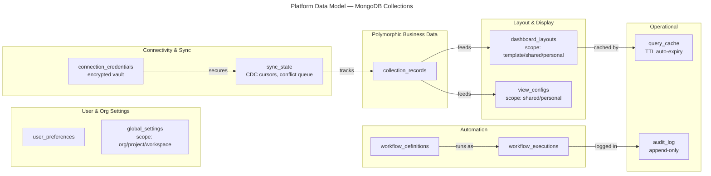

# Model — Business Data Platform

A multi-tenant SaaS data platform (like Kibana + Notion + Airtable) where tenants can:
- **Import or build** their own data model from scratch or via adapters
- **Connect their own databases** (PostgreSQL, MySQL, MongoDB) via public endpoint, SSH tunnel, or VPN
- **Real-time sync** bidirectional CDC between user databases and the platform
- **Provision managed databases** (Supabase PostgreSQL, MongoDB Atlas) for users without their own
- **Create dashboards** with drag-and-drop widgets, charts, KPIs
- **Define views** (table, kanban, calendar, gallery, form, chart, timeline)
- **Control access** with RBAC + ABAC (attribute-based) fine-grained permissions
- **Subscribe to plans** with usage metering, promotions, and pay-as-you-grow pricing
- **Customize everything** — personal layouts, filters, themes

> **5NF Compliance**: All SQL schemas follow strict Fifth Normal Form. Role
> assignments are centralized in `user_role_assignments` with context scoping
> (global/organization/project/workspace) instead of duplicating role columns
> across membership tables. ABAC conditions support per-role scoping via
> `role_id`. Audit columns (`created_at`, `updated_at`, `created_by`,
> `updated_by`) remain on entity tables as they are functionally dependent
> on each entity's primary key — not a normalization violation.

---

## Architecture: SQL vs NoSQL Split

| Concern | PostgreSQL (SQL) | MongoDB (NoSQL) |
|---------|-----------------|-----------------|
| **Identity & Auth** | Users, Roles, Permissions, ABAC, Sessions | — |
| **Tenant Structure** | Organizations, Projects, Workspaces, Members | — |
| **Schema Definitions** | Collections, Fields, Relations, Indices | — |
| **Dashboard/View Identity** | Dashboards, Views (who, where, permissions) | — |
| **Resources & Sharing** | Resource registry, Permissions, Versions, Tags | — |
| **Adapters** | Adapter connections, Mappings, Executions | — |
| **Connectivity** | DB Connections, Provisioned DBs, Sync Channels, Sync Executions | — |
| **Billing** | Plans, Features, Subscriptions, Promotions, Invoices, Payments, Usage | — |
| **System** | Webhooks, Notifications, Policy Rules, Files | — |
| **Business Data** | — | `collection_records` (polymorphic) |
| **Layout & Positions** | — | `dashboard_layouts` (personal/shared/template) |
| **View Configs** | — | `view_configs` (filters, sorts, field visibility) |
| **User Settings** | — | `user_preferences` (theme, locale, sidebar) |
| **Cache** | — | `query_cache` (TTL-based aggregation cache) |
| **Workflows** | — | `workflow_definitions` + `workflow_executions` |
| **Org Settings** | — | `global_settings` (branding, security, features) |
| **Audit Trail** | — | `audit_log` (append-only change tracking) |
| **Sync State** | — | `sync_state` (CDC cursors, lag, conflict queue) |
| **Credential Vault** | — | `connection_credentials` (encrypted DB credentials) |

**Principle**: SQL for structural integrity + ACID. MongoDB for flexible, deeply nested, per-user, frequently-changing data.

---

## Personal vs Shared Layout System

The core UX problem: users should be able to drag widgets freely, but admins should be able to publish layouts for everyone.

**Solution: 3-Layer Scope Resolution**

```
┌─────────────────────────────────────────────┐
│  personal   (user's own layout - highest)   │  ← User drags widgets
├─────────────────────────────────────────────┤
│  shared     (published for all members)     │  ← Admin clicks "Publish"
├─────────────────────────────────────────────┤
│  template   (org-level default - lowest)    │  ← Set during initial setup
└─────────────────────────────────────────────┘
Merge order: template → shared → personal (personal overrides everything)
```

- **User drags a widget** → saves to `personal` scope only (no one else is affected)
- **User with `dashboard:publish` permission** → pushes their layout to `shared` (affects all members)
- **Admin resets dashboard** → clears `shared` + `personal` scopes, reverts to `template`

Same pattern applies to **view_configs** (filters, sorts, column widths).

---

## Polymorphic Data Engine

The backend doesn't know the business model in advance. Instead:

1. **Tenant creates a Collection** (SQL) → defines the "table"
2. **Tenant adds Fields** (SQL) → defines columns with types & validation
3. **Backend syncs indexes** from `collection_indices` (SQL) → MongoDB
4. **Records are stored** in `collection_records` (MongoDB) → schema-free `data` object
5. **Frontend reads field definitions** → renders the correct UI controls
6. **Backend validates** records at write time against SQL field rules

```
PostgreSQL                         MongoDB
┌──────────────┐                   ┌───────────────────────────────┐
│ collections  │                   │ collection_records            │
│ ┌──────────┐ │    validates      │ {                             │
│ │ fields   │─┼──────────────────►│   collection_id: "uuid",     │
│ │ (schema) │ │                   │   data: {                    │
│ └──────────┘ │                   │     name: "Acme Corp",       │
│              │                   │     revenue: 1500000,        │
│ collection_  │    syncs indexes  │     status: "active"         │
│ indices     ─┼──────────────────►│   }                          │
└──────────────┘                   │ }                             │
                                   └───────────────────────────────┘
```

---

## Entity Relationship Diagram

```mermaid
---
title: Platform Data Model — SQL Tables
---

erDiagram
    %% ── Identity & Auth ─────────────────────────────
    users ||--o{ oauth_accounts : has
    users ||--o{ user_role_assignments : has
    users ||--o{ user_permissions : has
    users ||--o{ user_sessions : has
    users ||--o{ contacts : owns
    users ||--o{ api_keys : owns

    roles ||--o{ role_permissions : grants
    roles ||--o{ user_role_assignments : assigned_to
    roles ||--o{ abac_conditions : scoped_to
    permissions ||--o{ role_permissions : included_in
    permissions ||--o{ user_permissions : granted_to
    permissions ||--o{ abac_conditions : constrained_by

    user_role_assignments }o--|| roles : "context_type + context_id"

    %% ── Tenant Structure ────────────────────────────
    organizations ||--o{ organization_members : has
    organizations ||--o{ projects : contains
    organizations ||--o{ roles : scopes

    projects ||--o{ project_members : has
    projects ||--o{ workspaces : contains

    workspaces ||--o{ workspace_members : has
    workspaces ||--o{ collections : contains
    workspaces ||--o{ dashboards : contains
    workspaces ||--o{ views : contains

    %% ── Dynamic Schema ──────────────────────────────
    collections ||--o{ fields : defines
    collections ||--o{ collection_relations : source_of
    collections ||--o{ collection_indices : indexed_by
    collections ||--o{ views : displayed_by

    fields ||--o{ field_options : has_options

    %% ── Presentation Layer ──────────────────────────
    dashboards ||--o{ dashboard_permissions : secured_by
    views ||--o{ view_permissions : secured_by

    %% ── Resources ───────────────────────────────────
    resources ||--o{ resource_permissions : secured_by
    resources ||--o{ resource_versions : versioned_by
    resources ||--o{ resource_shares : shared_via
    resources ||--o{ resource_relations : linked_to
    resources ||--o{ resource_tags : tagged_with
    resources ||--o{ comments : commented_on

    tags ||--o{ resource_tags : applied_to

    %% ── Adapters ────────────────────────────────────
    adapters ||--o{ adapter_mappings : maps
    adapters ||--o{ adapter_executions : logs
    adapter_mappings }o--|| collections : targets

    %% ── Connectivity ────────────────────────────────
    database_connections ||--o{ sync_channels : syncs
    database_connections }o--o| provisioned_databases : managed_by
    sync_channels }o--|| collections : targets
    sync_channels ||--o{ sync_executions : logs

    %% ── Billing ─────────────────────────────────────
    plans ||--o{ plan_features : defines
    plans ||--o{ subscriptions : purchased_as
    promotions ||--o{ promotion_plans : applies_to
    promotion_plans }o--|| plans : discounts
    subscriptions }o--o| promotions : uses
    subscriptions ||--o{ invoices : generates
    invoices ||--o{ payments : paid_by
    usage_meters ||--o{ usage_records : tracks

    %% ── System ──────────────────────────────────────
    organizations ||--o{ webhooks : registers
    organizations ||--o{ policy_rules : enforces
    organizations ||--o{ adapters : connects
    organizations ||--o{ database_connections : connects_dbs
    organizations ||--o{ provisioned_databases : provisions
    organizations ||--o{ subscriptions : subscribes
    organizations ||--o{ invoices : billed
    organizations ||--o{ usage_records : metered
    organizations ||--o{ tags : defines
    organizations ||--o{ resources : owns
```



---

## MongoDB Collections Diagram



---

## File Structure

```
Model/
├── README.md                         ← this file
├── sql/
│   ├── schema.user.sql               ← Users, Auth, RBAC + ABAC, Sessions, API Keys
│   ├── schema.organization.sql       ← Organizations, Projects, Workspaces, Members
│   ├── schema.collection.sql         ← Collections, Fields, Relations, Indices
│   ├── schema.dashboard.sql          ← Dashboards, Views, Templates, Permissions
│   ├── schema.resource.sql           ← Resource registry, Versioning, Sharing, Tags, Comments
│   ├── schema.adapter.sql            ← External data adapters, Mappings, Sync
│   ├── schema.billing.sql            ← Plans, Subscriptions, Invoices, Payments, Promotions, Usage
│   ├── schema.connectivity.sql       ← DB Connections, Provisioned DBs, Sync Channels (CDC)
│   ├── schema.system.sql             ← Webhooks, Notifications, Policy Rules, Files
│   ├── optimization.sql              ← All indexes (run after schema files)
│   └── views.sql                     ← SQL views for common query patterns
└── nosql/                            ← TypeScript Mongoose schemas (@nestjs/mongoose)
    ├── index.ts                       ← Barrel export (all schemas, types, interfaces)
    ├── collection_records.ts          ← Polymorphic business data records
    ├── dashboard_layouts.ts           ← Widget positions, grid config (personal/shared/template)
    ├── view_configs.ts                ← Filters, sorts, field visibility, chart config
    ├── user_preferences.ts            ← Theme, locale, sidebar, favorites, recent items
    ├── query_cache.ts                 ← TTL-based aggregation result cache
    ├── workflow_states.ts             ← Workflow definitions + execution runtime
    ├── global_settings.ts             ← Org/workspace branding, security, feature flags
    ├── audit_log.ts                   ← Append-only change tracking
    ├── sync_state.ts                  ← CDC cursors, replication lag, conflict queue
    └── connection_credentials.ts      ← Encrypted database credential vault
```

---

## SQL Execution Order

```sql
-- 1. Extensions & core identity
\i schema.user.sql

-- 2. Tenant structure (references users, adds FK to roles)
\i schema.organization.sql

-- 3. Dynamic schema engine (references workspaces)
\i schema.collection.sql

-- 4. Presentation layer (references collections, workspaces)
\i schema.dashboard.sql

-- 5. Universal resource layer (references organizations)
\i schema.resource.sql

-- 6. Data adapters (references organizations, collections)
\i schema.adapter.sql

-- 7. Billing & subscriptions (references organizations, users)
\i schema.billing.sql

-- 8. Database connectivity & CDC sync (references organizations, collections)
\i schema.connectivity.sql

-- 9. System features (references organizations, users)
\i schema.system.sql

-- 10. Performance indexes (run last)
\i optimization.sql

-- 11. Query views (run last)
\i views.sql
```

---

## Permission Resolution Flow

```
Request: Can user X perform action Y on resource Z?

1. Check user_permissions (explicit deny → DENY immediately)
2. Check user_permissions (explicit grant → allow)
3. Check role_permissions via user_role_assignments
   └─ Resolve roles for the current context:
        user_role_assignments WHERE context_type matches + context_id matches
        → roles → role_permissions → permissions
4. Evaluate abac_conditions on the matched permission
   └─ Check global conditions (role_id IS NULL) AND role-specific conditions (role_id = user's role)
5. Evaluate policy_rules for the organization + resource_type
6. Check resource_permissions on the resource registry
7. Check entity-specific permissions (dashboard_permissions, view_permissions)
8. Default: DENY
```

### RBAC + ABAC Connectivity (5NF)

```
users ──→ user_role_assignments ──→ roles ──→ role_permissions ──→ permissions
            │ context_type              │                              │
            │ context_id                │                              │
            │ (scopes to org/           │                              │
            │  project/workspace)       │                              │
            │                           └──── abac_conditions ─────────┘
            │                                 (role_id optional:
users ──→ user_permissions ───────────────────→ scopes conditions per role)
            (direct grant/deny override)
```

---

## Database Connectivity Architecture

```
┌─────────────────────────────────────────────────────────────────────────┐
│  User's Infrastructure                                                  │
│                                                                         │
│  ┌──────────────┐  ┌──────────────┐  ┌──────────────┐                  │
│  │  PostgreSQL   │  │   MongoDB    │  │    MySQL     │                  │
│  │  (user-owned) │  │ (user-owned) │  │ (user-owned) │                  │
│  └──────┬───────┘  └──────┬───────┘  └──────┬───────┘                  │
│         │ CDC              │ Change          │ Binlog                    │
│         │ (logical repl)   │ Streams         │ streaming                 │
└─────────┼──────────────────┼─────────────────┼──────────────────────────┘
          │                  │                 │
    ┌─────┴──────────────────┴─────────────────┴─────┐
    │  Connection Layer                               │
    │  • Public endpoint (direct TCP)                 │
    │  • SSH tunnel (bastion host)                    │
    │  • VPN / VPC peering / Private Link             │
    │  • Credentials in MongoDB vault (encrypted)     │
    └─────────────────────┬───────────────────────────┘
                          │
    ┌─────────────────────┴───────────────────────────┐
    │  Sync Engine (CDC)                              │
    │  ┌─────────────┐  ┌─────────────┐              │
    │  │ sync_channel │→ │ sync_state  │ (MongoDB)    │
    │  │ (SQL)        │  │ (cursors,   │              │
    │  │              │  │  conflicts) │              │
    │  └──────┬──────┘  └─────────────┘              │
    │         │ bidirectional                          │
    └─────────┼───────────────────────────────────────┘
              ↕
    ┌─────────┴───────────────────────────────────────┐
    │  Platform                                       │
    │  ┌────────────────┐  ┌──────────────────┐       │
    │  │ collections    │  │ collection_records│       │
    │  │ fields (SQL)   │  │ (MongoDB)         │       │
    │  └────────────────┘  └──────────────────┘       │
    └─────────────────────────────────────────────────┘
```

### Managed Database Provisioning

For users without their own infrastructure:

```
User signs up → chooses "Create Database"
    ├── Supabase PostgreSQL (auto-provisioned via Supabase Management API)
    │   └── provisioned_databases (SQL) tracks instance lifecycle
    │
    └── MongoDB Atlas (auto-provisioned via Atlas Admin API)
        └── provisioned_databases (SQL) tracks instance lifecycle

database_connections.connection_type = 'managed'
database_connections.provisioned_db_id → provisioned_databases.id
```

---

## Billing & Subscription Model

```
plans ──→ plan_features (feature gates & quotas per tier)
  │
  └──→ subscriptions ──→ invoices ──→ payments
         │                    │
         └── promotions       └── usage_records ← usage_meters
              (discount codes,        (metered billing:
               percentage/fixed)       storage, API calls,
                                       adapters, members)

Subscription lifecycle:
  trialing → active → past_due → cancelled → expired
                    → paused → active (re-activated)

Quota enforcement:
  usage_records (current period SUM) vs plan_features (limit_value)
  → ok | warning (80%) | exceeded (100%)
```
