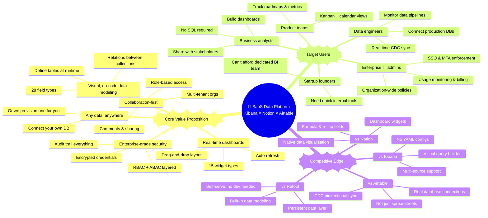
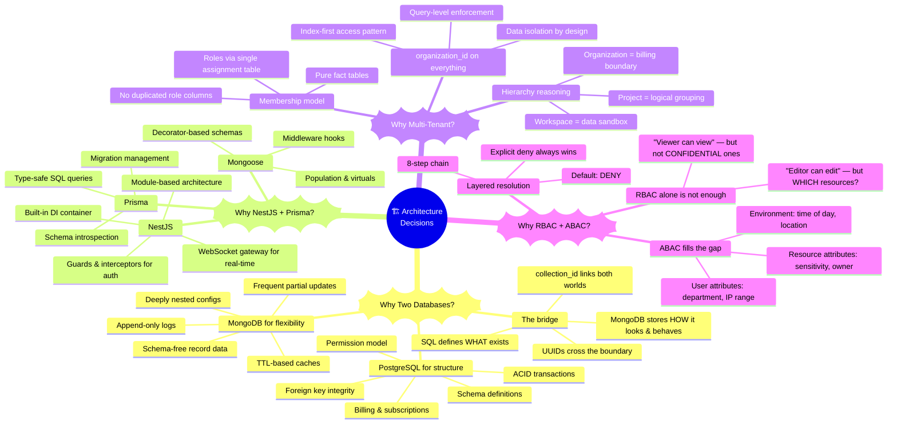
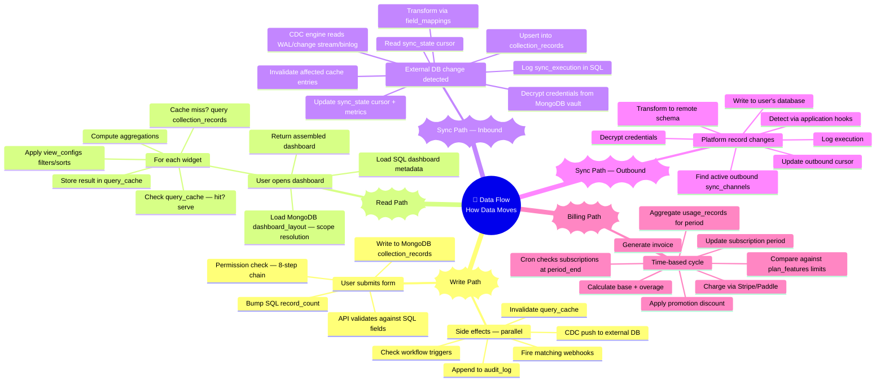
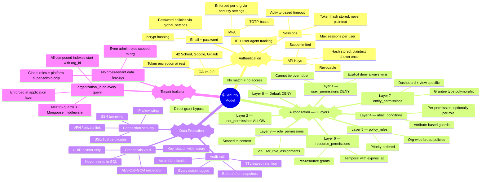
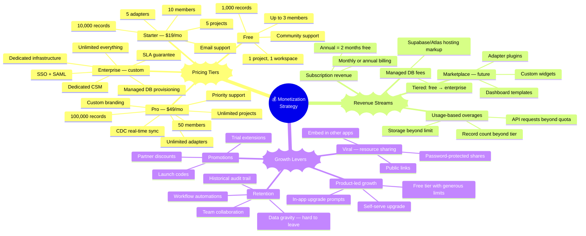
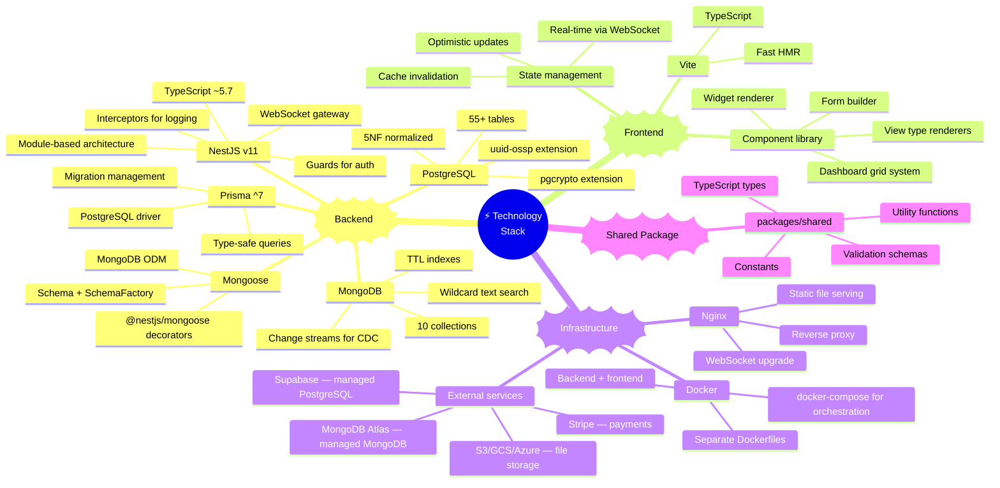
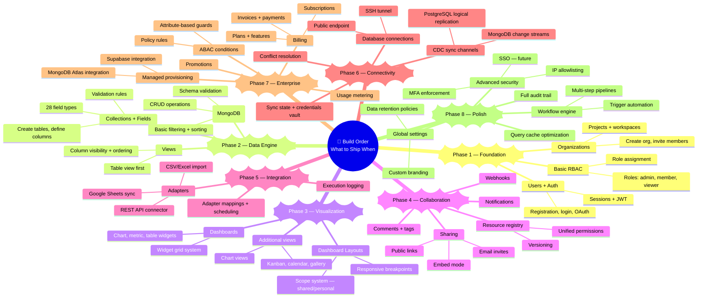

# Business Model — Full Mindmap

> How this SaaS platform (Kibana × Notion × Airtable) was conceived,
> from vision to implementation decisions.

---

## 1 — Product Vision Mindmap

---

## 2 — Architecture Thinking Mindmap

---

## 3 — Domain Decomposition Mindmap

```mermaid
mindmap
  root(("📐 Domain<br/>Decomposition"))
    ))1. Identity & Auth((
      Users
        Email + password
        OAuth providers: 42, Google, GitHub
        MFA with TOTP
        Status: online/offline/busy/away
      Sessions
        JWT token hashing
        IP tracking
        Activity timeout
        Multi-device support
      API Keys
        Scoped permissions
        Rate limiting
        Revocable
      Contacts
        Personal address book
        Link to platform users
        External contacts

    ))2. Organization Hierarchy((
      Organizations
        Tenant boundary
        Slug-based URL routing
        Feature flags via metadata
        Soft-delete with is_active
      Projects
        Logical grouping
        Icon + color theming
        Archivable
      Workspaces
        Data containers
        Types: default, data, analytics, admin, sandbox
        Default workspace per project
      Membership
        Pure join tables
        invited_by audit field
        No role column — uses user_role_assignments

    ))3. Permission Model((
      Roles
        4 scopes: global, org, project, workspace
        System roles are immutable
        Custom roles per org
      Permissions
        resource_type:action convention
        28+ atomic permissions
        System-defined, never edited
      ABAC Conditions
        Attached to permissions
        Optionally scoped to role
        AND/OR logic groups
      Policy Rules
        Org-wide broad policies
        Priority-based evaluation
        Allow/deny effects
      Direct Overrides
        Per-user grant/deny
        Temporal with expires_at
        Deny always wins

    ))4. Data Engine((
      Collections
        Runtime-defined tables
        28 field types
        Validation rules per field
        Display config per field
      Field Options
        Select/multi_select dropdowns
        Ordered, colored
      Collection Relations
        one_to_one, one_to_many, many_to_many
        Junction collections for M:N
        on_delete behavior
      Collection Indices
        Declarative in SQL
        Synced to MongoDB at runtime
        Unique + sparse support
      Records — MongoDB
        Schema-free data object
        Polymorphic cross-collection relations
        Soft-delete with is_deleted
        Full-text + wildcard indexes

    ))5. Presentation Layer((
      Dashboards
        Widget-based pages
        5 visibility levels
        Lock for editing control
        Auto-refresh interval
      Views
        10 view types
        Collection-bound
        Default view per collection
      Dashboard Templates
        Org-specific or global
        Category-based marketplace
        Clone to create new dash
      Layouts — MongoDB
        3-layer scope: template → shared → personal
        Grid config with responsive breakpoints
        15 widget types
        Global cross-widget filters
      View Configs — MongoDB
        Filters with nested AND/OR groups
        18 filter operators
        Kanban, calendar, gallery, chart configs
        Conditional row coloring

    ))6. Resource Registry((
      Universal registry
        Every entity registers once
        Inherit permissions, versions, shares
        9 resource types
      Versioning
        Snapshot-based
        Full state per version
        Optional diff for UI
      Sharing
        Link, email, embed modes
        Password protection
        Usage limits + counter
        Expirable
      Tagging
        Org-scoped taxonomy
        Many-to-many via junction
      Comments
        Threaded via parent_id
        Resolvable for reviews
      Cross-resource relations
        depends_on, linked_to
        embedded_in, derived_from
        parent_of

    ))7. Integration Layer((
      Adapters — generic connectors
        REST API, GraphQL
        CSV, Excel, Google Sheets
        S3 file imports
        Webhook receivers
      Adapter Mappings
        Source path → collection
        Field mapping + transforms
        Cron scheduling or realtime
        Conflict strategy
      Adapter Executions
        Immutable event log
        Metrics: processed, created, updated, failed
        Duration tracking

    ))8. Database Connectivity((
      User-owned databases
        Public endpoint
        SSH tunnel
        VPN / private link
      Managed provisioning
        Supabase PostgreSQL
        MongoDB Atlas
        PlanetScale, Neon — future
        Free → Enterprise tiers
      Database Connections
        7 engine types
        Schema introspection + caching
        Health monitoring
        Connection pooling
      CDC Sync Channels
        4 sync modes
        3 sync directions
        5 conflict strategies
        Error threshold + auto-pause
      Sync Executions
        Per-channel history
        Records in/out/conflicted
        Latency tracking
      Credentials — MongoDB
        AES-256-GCM encryption
        7 credential types
        Key rotation policies
        TTL for temporary creds
      Sync State — MongoDB
        CDC cursors per engine
        Lag monitoring + history
        Conflict queue with field-level detail

    ))9. Billing & Monetization((
      Plans
        free, starter, pro, enterprise
        Monthly + yearly pricing
        Trial periods
        Public + private plans
      Plan Features
        Decomposed limits per plan
        18+ feature keys
        NULL = unlimited
      Subscriptions
        One active per org
        6-state lifecycle
        External provider ID — Stripe/Paddle
      Promotions
        Unique codes
        percentage, fixed, trial extension
        Duration-limited
        Redemption limits
        Stackable flag — future
      Invoices
        Per billing cycle
        Line item breakdown
        6-state lifecycle
        External provider mapping
      Payments
        6 payment methods
        3 gateways
        Refund tracking
        Failure reasons
      Usage Metering
        Platform-defined meters
        3 aggregation types
        Reset per billing cycle
        Overage charging

    ))10. System Services((
      Webhooks
        Event-driven outbound
        HMAC signature verification
        Retry with backoff
        Delivery logging
      Notifications
        In-app notification index
        6 notification types
        Deep-link action URLs
        Read/unread tracking
      File Uploads
        Multi-backend storage
        S3 / GCS / Azure / local
        UUID-based stored names
        Organization-scoped
      Workflow Engine — MongoDB
        8 trigger types
        13 step types
        Error strategy per step
        Execution tracking with step results
      Query Cache — MongoDB
        Fingerprint-based dedup
        TTL auto-expiry
        Event-based invalidation
        Widget + view scoping
      Audit Log — MongoDB
        Append-only immutable
        4 actor types
        Before/after/diff snapshots
        TTL-based retention
      Global Settings — MongoDB
        3-scope inheritance
        Branding customization
        Security policies
        Feature toggles
      User Preferences — MongoDB
        Theme, locale, timezone
        Notification channels
        Sidebar layout
        Keyboard shortcuts
        Onboarding state
```

---

## 4 — Data Flow Thinking Mindmap

---

## 5 — Security Thinking Mindmap

---

## 6 — Monetization Strategy Mindmap

---

## 7 — Technology Stack Mindmap

---

## 8 — Feature Prioritization Mindmap (Build Order)

