# MongoDB Schema — Complete NoSQL Architecture

> All collections use `@nestjs/mongoose` decorators with TypeScript.
> Every document stores `organization_id` for **multi-tenant isolation**.
> MongoDB handles flexible, deeply nested, frequently-changing data.
> PostgreSQL handles structural integrity and ACID (see `sql/`).

---

## 1 — Collection Overview

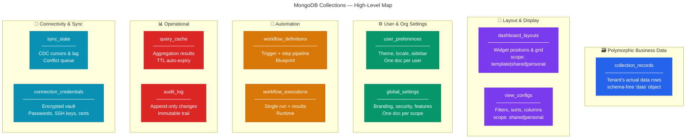
```mermaid
---
title: MongoDB Collections — High-Level Map
---
graph TB
    classDef business fill:#2563eb,stroke:#1d4ed8,color:#fff
    classDef display fill:#7c3aed,stroke:#6d28d9,color:#fff
    classDef settings fill:#059669,stroke:#047857,color:#fff
    classDef automation fill:#d97706,stroke:#b45309,color:#fff
    classDef operational fill:#dc2626,stroke:#b91c1c,color:#fff
    classDef connectivity fill:#0891b2,stroke:#0e7490,color:#fff

    subgraph BIZ["🗃️ Polymorphic Business Data"]
        CR["collection_records\n─────────────────\nTenant's actual data rows\nschema-free 'data' object"]
    end

    subgraph DISPLAY["🎨 Layout & Display"]
        DL["dashboard_layouts\n──────────────────\nWidget positions & grid\nscope: template|shared|personal"]
        VC["view_configs\n─────────────\nFilters, sorts, columns\nscope: shared|personal"]
    end

    subgraph SETTINGS["⚙️ User & Org Settings"]
        UP["user_preferences\n────────────────\nTheme, locale, sidebar\nOne doc per user"]
        GS["global_settings\n───────────────\nBranding, security, features\nOne doc per scope"]
    end

    subgraph AUTO["🤖 Automation"]
        WD["workflow_definitions\n───────────────────\nTrigger + step pipeline\nBlueprint"]
        WE["workflow_executions\n──────────────────\nSingle run + results\nRuntime"]
    end

    subgraph OPS["📊 Operational"]
        QC["query_cache\n────────────\nAggregation results\nTTL auto-expiry"]
        AL["audit_log\n──────────\nAppend-only changes\nImmutable trail"]
    end

    subgraph SYNC["🔄 Connectivity & Sync"]
        SS["sync_state\n──────────\nCDC cursors & lag\nConflict queue"]
        CC["connection_credentials\n─────────────────────\nEncrypted vault\nPasswords, SSH keys, certs"]
    end

    CR:::business
    DL:::display
    VC:::display
    UP:::settings
    GS:::settings
    WD:::automation
    WE:::automation
    QC:::operational
    AL:::operational
    SS:::connectivity
    CC:::connectivity
```

---

## 2 — Data Flow & Relationships

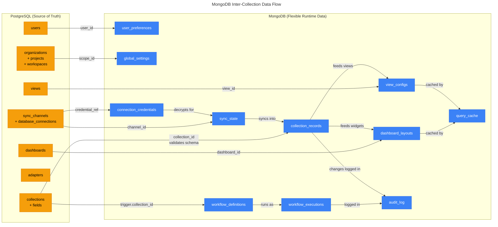
```mermaid
---
title: MongoDB Inter-Collection Data Flow
---
flowchart LR
    classDef sql fill:#f59e0b,stroke:#d97706,color:#000
    classDef mongo fill:#3b82f6,stroke:#2563eb,color:#fff

    subgraph SQL["PostgreSQL (Source of Truth)"]
        direction TB
        S_USERS["users"]:::sql
        S_COLL["collections\n+ fields"]:::sql
        S_DASH["dashboards"]:::sql
        S_VIEWS["views"]:::sql
        S_ORG["organizations\n+ projects\n+ workspaces"]:::sql
        S_ADAPT["adapters"]:::sql
        S_SYNC["sync_channels\n+ database_connections"]:::sql
    end

    subgraph MONGO["MongoDB (Flexible Runtime Data)"]
        direction TB
        CR["collection_records"]:::mongo
        DL["dashboard_layouts"]:::mongo
        VC["view_configs"]:::mongo
        UP["user_preferences"]:::mongo
        GS["global_settings"]:::mongo
        WD["workflow_definitions"]:::mongo
        WE["workflow_executions"]:::mongo
        QC["query_cache"]:::mongo
        AL["audit_log"]:::mongo
        SS["sync_state"]:::mongo
        CC["connection_credentials"]:::mongo
    end

    S_COLL -- "collection_id\nvalidates schema" --> CR
    S_DASH -- "dashboard_id" --> DL
    S_VIEWS -- "view_id" --> VC
    S_USERS -- "user_id" --> UP
    S_ORG -- "scope_id" --> GS
    S_COLL -- "trigger.collection_id" --> WD
    S_SYNC -- "channel_id" --> SS
    S_SYNC -- "credential_ref" --> CC

    CR -- "feeds widgets" --> DL
    CR -- "feeds views" --> VC
    DL -- "cached by" --> QC
    VC -- "cached by" --> QC
    WD -- "runs as" --> WE
    WE -- "logged in" --> AL
    CR -- "changes logged in" --> AL
    SS -- "syncs into" --> CR
    CC -- "decrypts for" --> SS
```

---

## 3 — Document Structure Diagrams

### 3.1 — collection_records

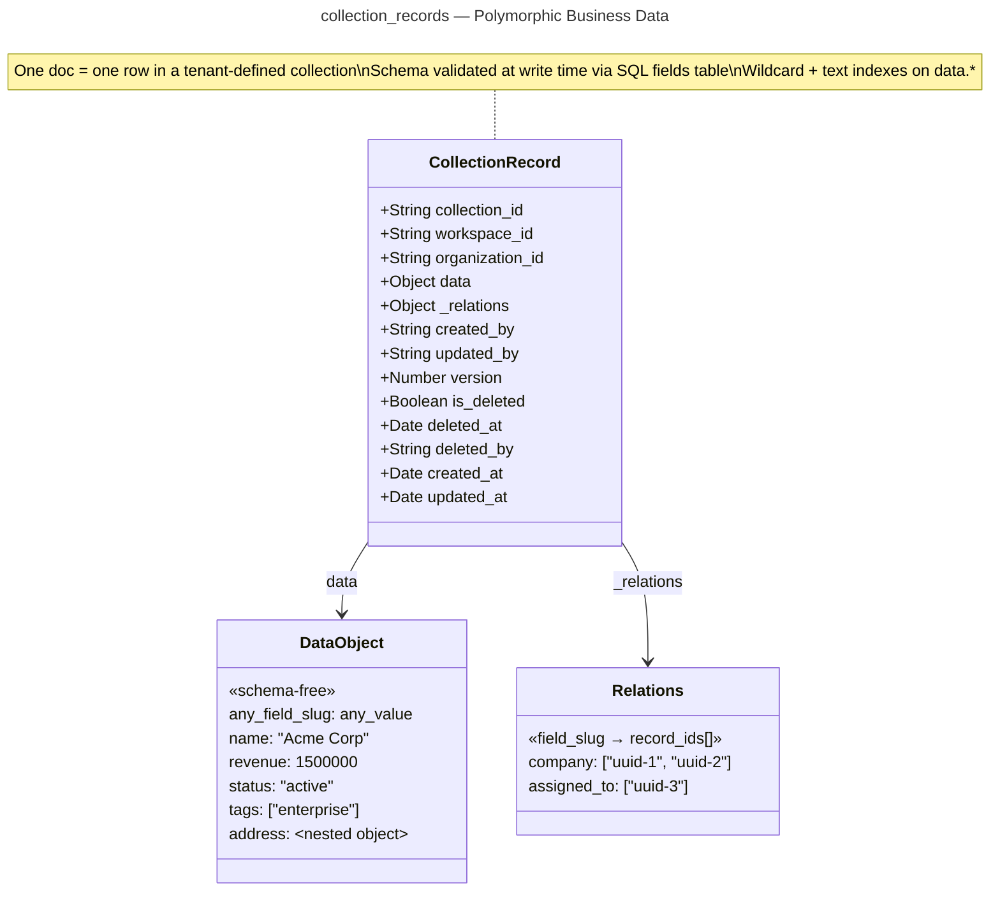
```mermaid
---
title: collection_records — Polymorphic Business Data
---
classDiagram
    class CollectionRecord {
        +String collection_id
        +String workspace_id
        +String organization_id
        +Object data
        +Object _relations
        +String created_by
        +String updated_by
        +Number version
        +Boolean is_deleted
        +Date deleted_at
        +String deleted_by
        +Date created_at
        +Date updated_at
    }

    class DataObject {
        «schema-free»
        any_field_slug: any_value
        name: "Acme Corp"
        revenue: 1500000
        status: "active"
        tags: ["enterprise"]
        address: ~nested object~
    }

    class Relations {
        «field_slug → record_ids[]»
        company: ["uuid-1", "uuid-2"]
        assigned_to: ["uuid-3"]
    }

    CollectionRecord --> DataObject : data
    CollectionRecord --> Relations : _relations

    note for CollectionRecord "One doc = one row in a tenant-defined collection\nSchema validated at write time via SQL fields table\nWildcard + text indexes on data.*"
```

### 3.2 — dashboard_layouts

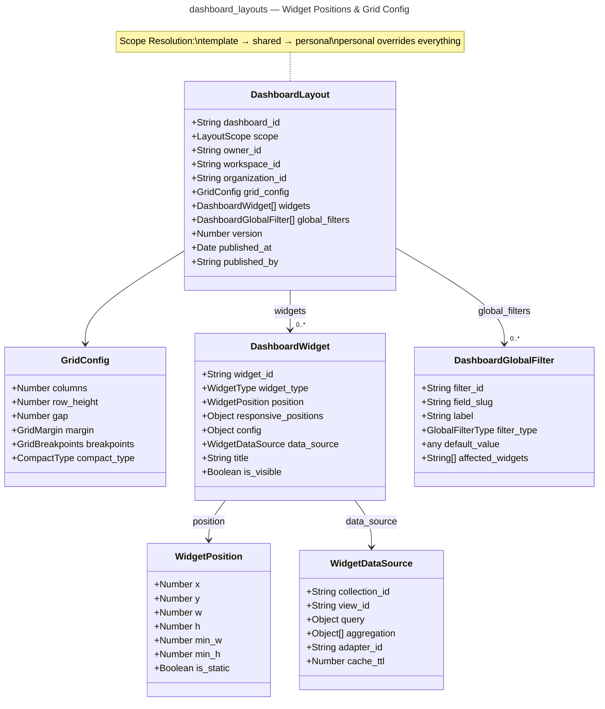
```mermaid
---
title: dashboard_layouts — Widget Positions & Grid Config
---
classDiagram
    class DashboardLayout {
        +String dashboard_id
        +LayoutScope scope
        +String owner_id
        +String workspace_id
        +String organization_id
        +GridConfig grid_config
        +DashboardWidget[] widgets
        +DashboardGlobalFilter[] global_filters
        +Number version
        +Date published_at
        +String published_by
    }

    class GridConfig {
        +Number columns
        +Number row_height
        +Number gap
        +GridMargin margin
        +GridBreakpoints breakpoints
        +CompactType compact_type
    }

    class DashboardWidget {
        +String widget_id
        +WidgetType widget_type
        +WidgetPosition position
        +Object responsive_positions
        +Object config
        +WidgetDataSource data_source
        +String title
        +Boolean is_visible
    }

    class WidgetPosition {
        +Number x
        +Number y
        +Number w
        +Number h
        +Number min_w
        +Number min_h
        +Boolean is_static
    }

    class WidgetDataSource {
        +String collection_id
        +String view_id
        +Object query
        +Object[] aggregation
        +String adapter_id
        +Number cache_ttl
    }

    class DashboardGlobalFilter {
        +String filter_id
        +String field_slug
        +String label
        +GlobalFilterType filter_type
        +any default_value
        +String[] affected_widgets
    }

    DashboardLayout --> GridConfig
    DashboardLayout --> "0..*" DashboardWidget : widgets
    DashboardLayout --> "0..*" DashboardGlobalFilter : global_filters
    DashboardWidget --> WidgetPosition : position
    DashboardWidget --> WidgetDataSource : data_source

    note for DashboardLayout "Scope Resolution:\ntemplate → shared → personal\npersonal overrides everything"
```

### 3.3 — view_configs

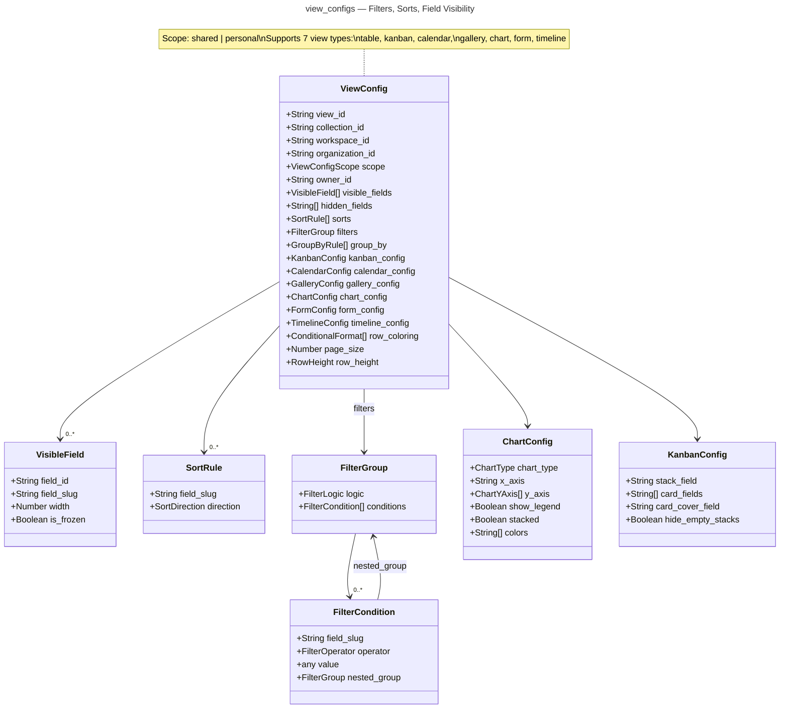
```mermaid
---
title: view_configs — Filters, Sorts, Field Visibility
---
classDiagram
    class ViewConfig {
        +String view_id
        +String collection_id
        +String workspace_id
        +String organization_id
        +ViewConfigScope scope
        +String owner_id
        +VisibleField[] visible_fields
        +String[] hidden_fields
        +SortRule[] sorts
        +FilterGroup filters
        +GroupByRule[] group_by
        +KanbanConfig kanban_config
        +CalendarConfig calendar_config
        +GalleryConfig gallery_config
        +ChartConfig chart_config
        +FormConfig form_config
        +TimelineConfig timeline_config
        +ConditionalFormat[] row_coloring
        +Number page_size
        +RowHeight row_height
    }

    class VisibleField {
        +String field_id
        +String field_slug
        +Number width
        +Boolean is_frozen
    }

    class SortRule {
        +String field_slug
        +SortDirection direction
    }

    class FilterGroup {
        +FilterLogic logic
        +FilterCondition[] conditions
    }

    class FilterCondition {
        +String field_slug
        +FilterOperator operator
        +any value
        +FilterGroup nested_group
    }

    class ChartConfig {
        +ChartType chart_type
        +String x_axis
        +ChartYAxis[] y_axis
        +Boolean show_legend
        +Boolean stacked
        +String[] colors
    }

    class KanbanConfig {
        +String stack_field
        +String[] card_fields
        +String card_cover_field
        +Boolean hide_empty_stacks
    }

    ViewConfig --> "0..*" VisibleField
    ViewConfig --> "0..*" SortRule
    ViewConfig --> FilterGroup : filters
    FilterGroup --> "0..*" FilterCondition
    FilterCondition --> FilterGroup : nested_group
    ViewConfig --> ChartConfig
    ViewConfig --> KanbanConfig

    note for ViewConfig "Scope: shared | personal\nSupports 7 view types:\ntable, kanban, calendar,\ngallery, chart, form, timeline"
```

### 3.4 — user_preferences

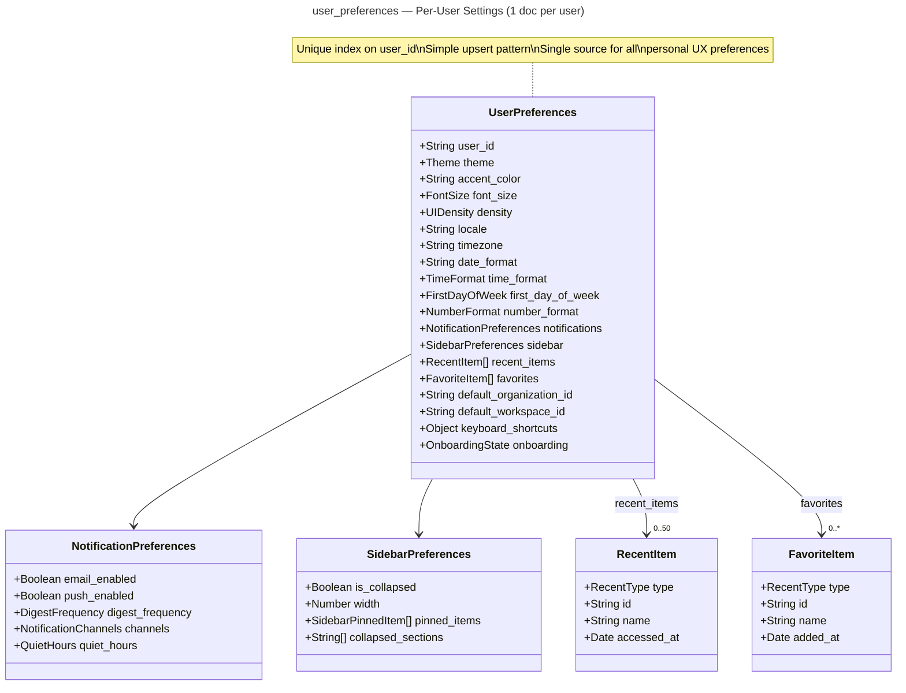
```mermaid
---
title: user_preferences — Per-User Settings (1 doc per user)
---
classDiagram
    class UserPreferences {
        +String user_id
        +Theme theme
        +String accent_color
        +FontSize font_size
        +UIDensity density
        +String locale
        +String timezone
        +String date_format
        +TimeFormat time_format
        +FirstDayOfWeek first_day_of_week
        +NumberFormat number_format
        +NotificationPreferences notifications
        +SidebarPreferences sidebar
        +RecentItem[] recent_items
        +FavoriteItem[] favorites
        +String default_organization_id
        +String default_workspace_id
        +Object keyboard_shortcuts
        +OnboardingState onboarding
    }

    class NotificationPreferences {
        +Boolean email_enabled
        +Boolean push_enabled
        +DigestFrequency digest_frequency
        +NotificationChannels channels
        +QuietHours quiet_hours
    }

    class SidebarPreferences {
        +Boolean is_collapsed
        +Number width
        +SidebarPinnedItem[] pinned_items
        +String[] collapsed_sections
    }

    class RecentItem {
        +RecentType type
        +String id
        +String name
        +Date accessed_at
    }

    class FavoriteItem {
        +RecentType type
        +String id
        +String name
        +Date added_at
    }

    UserPreferences --> NotificationPreferences
    UserPreferences --> SidebarPreferences
    UserPreferences --> "0..50" RecentItem : recent_items
    UserPreferences --> "0..*" FavoriteItem : favorites

    note for UserPreferences "Unique index on user_id\nSimple upsert pattern\nSingle source for all\npersonal UX preferences"
```

### 3.5 — workflow_states (definitions + executions)

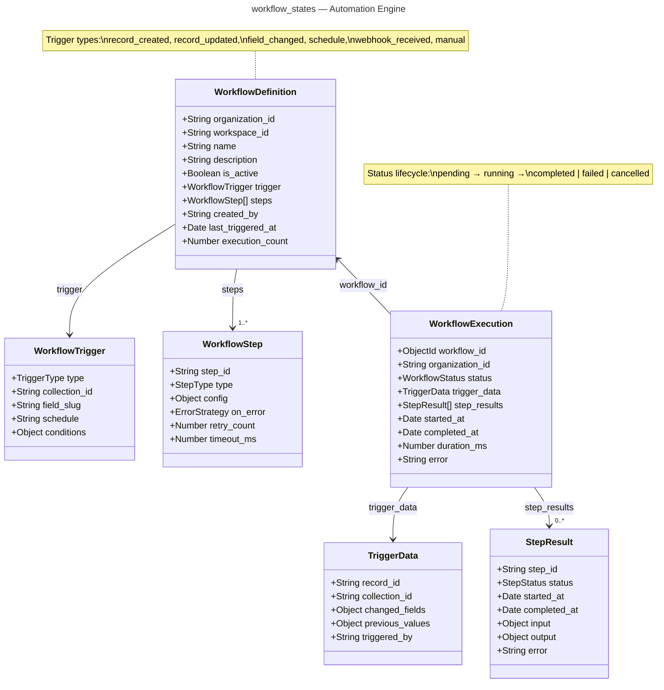
```mermaid
---
title: workflow_states — Automation Engine
---
classDiagram
    class WorkflowDefinition {
        +String organization_id
        +String workspace_id
        +String name
        +String description
        +Boolean is_active
        +WorkflowTrigger trigger
        +WorkflowStep[] steps
        +String created_by
        +Date last_triggered_at
        +Number execution_count
    }

    class WorkflowTrigger {
        +TriggerType type
        +String collection_id
        +String field_slug
        +String schedule
        +Object conditions
    }

    class WorkflowStep {
        +String step_id
        +StepType type
        +Object config
        +ErrorStrategy on_error
        +Number retry_count
        +Number timeout_ms
    }

    class WorkflowExecution {
        +ObjectId workflow_id
        +String organization_id
        +WorkflowStatus status
        +TriggerData trigger_data
        +StepResult[] step_results
        +Date started_at
        +Date completed_at
        +Number duration_ms
        +String error
    }

    class StepResult {
        +String step_id
        +StepStatus status
        +Date started_at
        +Date completed_at
        +Object input
        +Object output
        +String error
    }

    class TriggerData {
        +String record_id
        +String collection_id
        +Object changed_fields
        +Object previous_values
        +String triggered_by
    }

    WorkflowDefinition --> WorkflowTrigger : trigger
    WorkflowDefinition --> "1..*" WorkflowStep : steps
    WorkflowDefinition <-- WorkflowExecution : workflow_id
    WorkflowExecution --> TriggerData : trigger_data
    WorkflowExecution --> "0..*" StepResult : step_results

    note for WorkflowDefinition "Trigger types:\nrecord_created, record_updated,\nfield_changed, schedule,\nwebhook_received, manual"
    note for WorkflowExecution "Status lifecycle:\npending → running →\ncompleted | failed | cancelled"
```

### 3.6 — query_cache

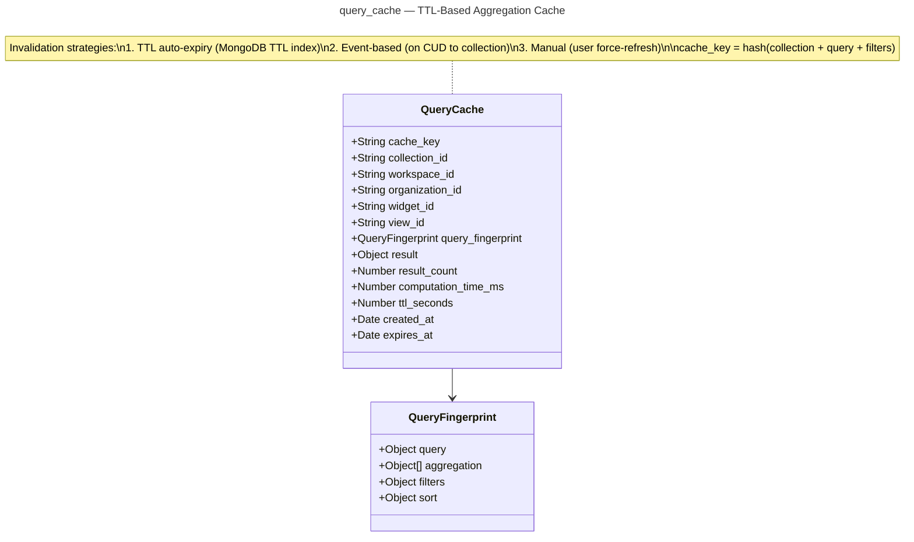
```mermaid
---
title: query_cache — TTL-Based Aggregation Cache
---
classDiagram
    class QueryCache {
        +String cache_key
        +String collection_id
        +String workspace_id
        +String organization_id
        +String widget_id
        +String view_id
        +QueryFingerprint query_fingerprint
        +Object result
        +Number result_count
        +Number computation_time_ms
        +Number ttl_seconds
        +Date created_at
        +Date expires_at
    }

    class QueryFingerprint {
        +Object query
        +Object[] aggregation
        +Object filters
        +Object sort
    }

    QueryCache --> QueryFingerprint

    note for QueryCache "Invalidation strategies:\n1. TTL auto-expiry (MongoDB TTL index)\n2. Event-based (on CUD to collection)\n3. Manual (user force-refresh)\n\ncache_key = hash(collection + query + filters)"
```

### 3.7 — global_settings

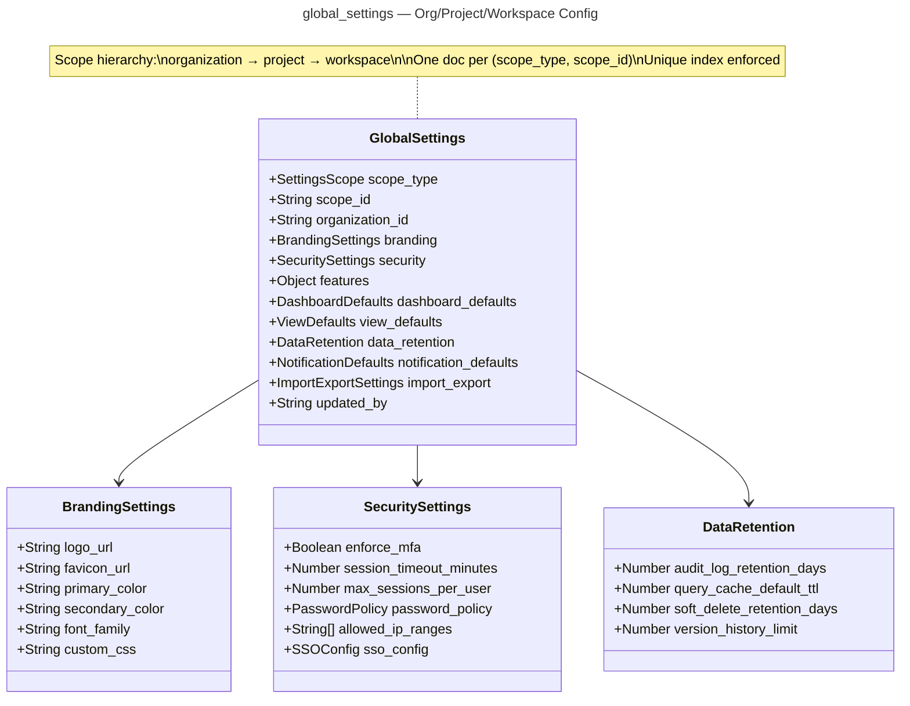
```mermaid
---
title: global_settings — Org/Project/Workspace Config
---
classDiagram
    class GlobalSettings {
        +SettingsScope scope_type
        +String scope_id
        +String organization_id
        +BrandingSettings branding
        +SecuritySettings security
        +Object features
        +DashboardDefaults dashboard_defaults
        +ViewDefaults view_defaults
        +DataRetention data_retention
        +NotificationDefaults notification_defaults
        +ImportExportSettings import_export
        +String updated_by
    }

    class BrandingSettings {
        +String logo_url
        +String favicon_url
        +String primary_color
        +String secondary_color
        +String font_family
        +String custom_css
    }

    class SecuritySettings {
        +Boolean enforce_mfa
        +Number session_timeout_minutes
        +Number max_sessions_per_user
        +PasswordPolicy password_policy
        +String[] allowed_ip_ranges
        +SSOConfig sso_config
    }

    class DataRetention {
        +Number audit_log_retention_days
        +Number query_cache_default_ttl
        +Number soft_delete_retention_days
        +Number version_history_limit
    }

    GlobalSettings --> BrandingSettings
    GlobalSettings --> SecuritySettings
    GlobalSettings --> DataRetention

    note for GlobalSettings "Scope hierarchy:\norganization → project → workspace\n\nOne doc per (scope_type, scope_id)\nUnique index enforced"
```

### 3.8 — audit_log

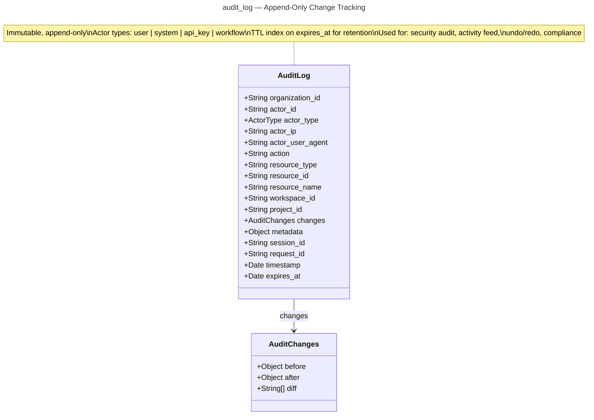
```mermaid
---
title: audit_log — Append-Only Change Tracking
---
classDiagram
    class AuditLog {
        +String organization_id
        +String actor_id
        +ActorType actor_type
        +String actor_ip
        +String actor_user_agent
        +String action
        +String resource_type
        +String resource_id
        +String resource_name
        +String workspace_id
        +String project_id
        +AuditChanges changes
        +Object metadata
        +String session_id
        +String request_id
        +Date timestamp
        +Date expires_at
    }

    class AuditChanges {
        +Object before
        +Object after
        +String[] diff
    }

    AuditLog --> AuditChanges : changes

    note for AuditLog "Immutable, append-only\nActor types: user | system | api_key | workflow\nTTL index on expires_at for retention\nUsed for: security audit, activity feed,\nundo/redo, compliance"
```

### 3.9 — sync_state

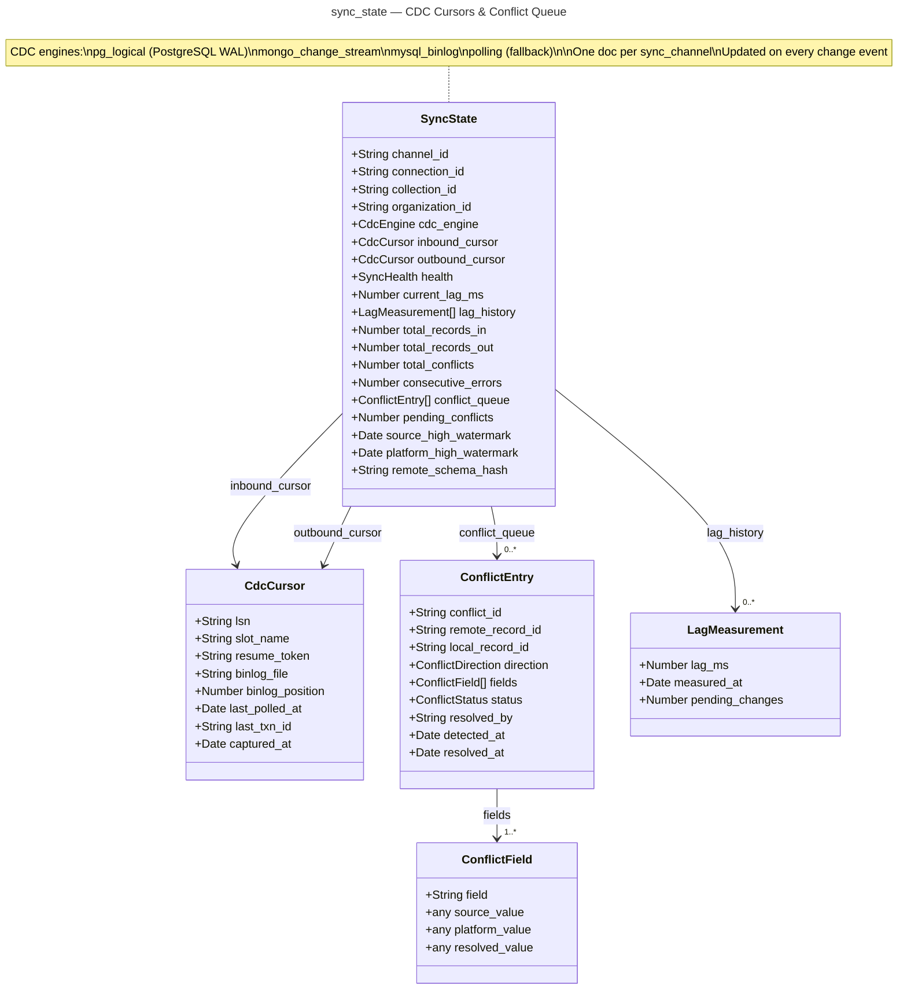
```mermaid
---
title: sync_state — CDC Cursors & Conflict Queue
---
classDiagram
    class SyncState {
        +String channel_id
        +String connection_id
        +String collection_id
        +String organization_id
        +CdcEngine cdc_engine
        +CdcCursor inbound_cursor
        +CdcCursor outbound_cursor
        +SyncHealth health
        +Number current_lag_ms
        +LagMeasurement[] lag_history
        +Number total_records_in
        +Number total_records_out
        +Number total_conflicts
        +Number consecutive_errors
        +ConflictEntry[] conflict_queue
        +Number pending_conflicts
        +Date source_high_watermark
        +Date platform_high_watermark
        +String remote_schema_hash
    }

    class CdcCursor {
        +String lsn
        +String slot_name
        +String resume_token
        +String binlog_file
        +Number binlog_position
        +Date last_polled_at
        +String last_txn_id
        +Date captured_at
    }

    class ConflictEntry {
        +String conflict_id
        +String remote_record_id
        +String local_record_id
        +ConflictDirection direction
        +ConflictField[] fields
        +ConflictStatus status
        +String resolved_by
        +Date detected_at
        +Date resolved_at
    }

    class ConflictField {
        +String field
        +any source_value
        +any platform_value
        +any resolved_value
    }

    class LagMeasurement {
        +Number lag_ms
        +Date measured_at
        +Number pending_changes
    }

    SyncState --> CdcCursor : inbound_cursor
    SyncState --> CdcCursor : outbound_cursor
    SyncState --> "0..*" ConflictEntry : conflict_queue
    SyncState --> "0..*" LagMeasurement : lag_history
    ConflictEntry --> "1..*" ConflictField : fields

    note for SyncState "CDC engines:\npg_logical (PostgreSQL WAL)\nmongo_change_stream\nmysql_binlog\npolling (fallback)\n\nOne doc per sync_channel\nUpdated on every change event"
```

### 3.10 — connection_credentials

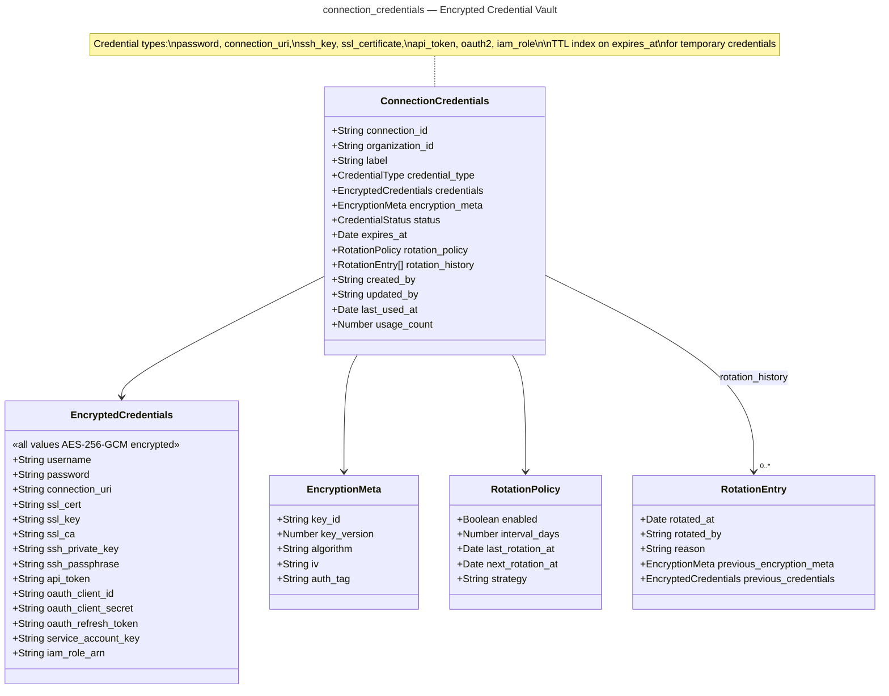
```mermaid
---
title: connection_credentials — Encrypted Credential Vault
---
classDiagram
    class ConnectionCredentials {
        +String connection_id
        +String organization_id
        +String label
        +CredentialType credential_type
        +EncryptedCredentials credentials
        +EncryptionMeta encryption_meta
        +CredentialStatus status
        +Date expires_at
        +RotationPolicy rotation_policy
        +RotationEntry[] rotation_history
        +String created_by
        +String updated_by
        +Date last_used_at
        +Number usage_count
    }

    class EncryptedCredentials {
        «all values AES-256-GCM encrypted»
        +String username
        +String password
        +String connection_uri
        +String ssl_cert
        +String ssl_key
        +String ssl_ca
        +String ssh_private_key
        +String ssh_passphrase
        +String api_token
        +String oauth_client_id
        +String oauth_client_secret
        +String oauth_refresh_token
        +String service_account_key
        +String iam_role_arn
    }

    class EncryptionMeta {
        +String key_id
        +Number key_version
        +String algorithm
        +String iv
        +String auth_tag
    }

    class RotationPolicy {
        +Boolean enabled
        +Number interval_days
        +Date last_rotation_at
        +Date next_rotation_at
        +String strategy
    }

    class RotationEntry {
        +Date rotated_at
        +String rotated_by
        +String reason
        +EncryptionMeta previous_encryption_meta
        +EncryptedCredentials previous_credentials
    }

    ConnectionCredentials --> EncryptedCredentials
    ConnectionCredentials --> EncryptionMeta
    ConnectionCredentials --> RotationPolicy
    ConnectionCredentials --> "0..*" RotationEntry : rotation_history

    note for ConnectionCredentials "Credential types:\npassword, connection_uri,\nssh_key, ssl_certificate,\napi_token, oauth2, iam_role\n\nTTL index on expires_at\nfor temporary credentials"
```

---

## 4 — Scope & Layering System

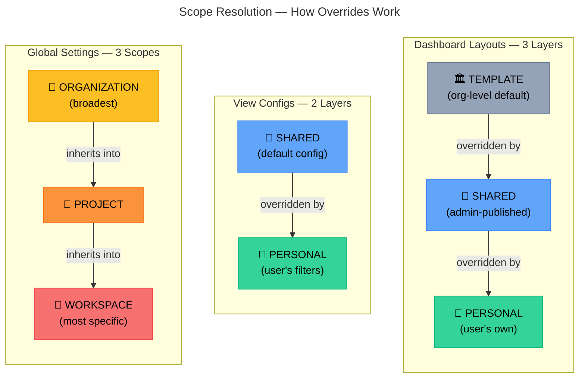
```mermaid
---
title: Scope Resolution — How Overrides Work
---
graph TB
    subgraph "Dashboard Layouts — 3 Layers"
        direction TB
        T["🏛️ TEMPLATE\n(org-level default)"]
        SH["📢 SHARED\n(admin-published)"]
        P["👤 PERSONAL\n(user's own)"]

        T -->|"overridden by"| SH
        SH -->|"overridden by"| P
    end

    subgraph "View Configs — 2 Layers"
        direction TB
        VS["📢 SHARED\n(default config)"]
        VP["👤 PERSONAL\n(user's filters)"]

        VS -->|"overridden by"| VP
    end

    subgraph "Global Settings — 3 Scopes"
        direction TB
        ORG["🏢 ORGANIZATION\n(broadest)"]
        PRJ["📁 PROJECT"]
        WS["📂 WORKSPACE\n(most specific)"]

        ORG -->|"inherits into"| PRJ
        PRJ -->|"inherits into"| WS
    end

    style T fill:#94a3b8,stroke:#64748b,color:#000
    style SH fill:#60a5fa,stroke:#3b82f6,color:#000
    style P fill:#34d399,stroke:#10b981,color:#000
    style VS fill:#60a5fa,stroke:#3b82f6,color:#000
    style VP fill:#34d399,stroke:#10b981,color:#000
    style ORG fill:#fbbf24,stroke:#f59e0b,color:#000
    style PRJ fill:#fb923c,stroke:#f97316,color:#000
    style WS fill:#f87171,stroke:#ef4444,color:#000
```

---

## 5 — SQL ↔ MongoDB Integration Map

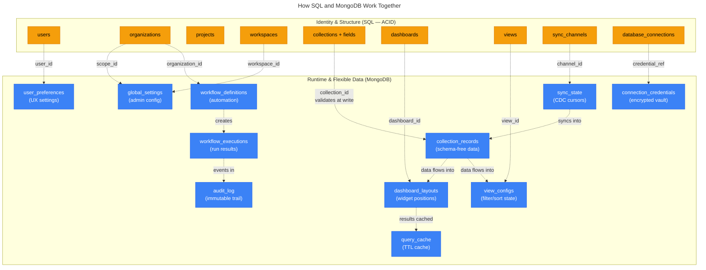
```mermaid
---
title: How SQL and MongoDB Work Together
---
flowchart TB
    classDef sql fill:#f59e0b,stroke:#d97706,color:#000
    classDef mongo fill:#3b82f6,stroke:#2563eb,color:#fff
    classDef arrow fill:none,stroke:none

    subgraph IDENTITY["Identity & Structure (SQL — ACID)"]
        U["users"]:::sql
        O["organizations"]:::sql
        P["projects"]:::sql
        W["workspaces"]:::sql
        C["collections + fields"]:::sql
        D["dashboards"]:::sql
        V["views"]:::sql
        SYNC_CH["sync_channels"]:::sql
        DB_CONN["database_connections"]:::sql
    end

    subgraph RUNTIME["Runtime & Flexible Data (MongoDB)"]
        CR["collection_records\n(schema-free data)"]:::mongo
        DL["dashboard_layouts\n(widget positions)"]:::mongo
        VC["view_configs\n(filter/sort state)"]:::mongo
        UP["user_preferences\n(UX settings)"]:::mongo
        GS["global_settings\n(admin config)"]:::mongo
        WD["workflow_definitions\n(automation)"]:::mongo
        WE["workflow_executions\n(run results)"]:::mongo
        QC["query_cache\n(TTL cache)"]:::mongo
        AL["audit_log\n(immutable trail)"]:::mongo
        SS["sync_state\n(CDC cursors)"]:::mongo
        CC["connection_credentials\n(encrypted vault)"]:::mongo
    end

    C -. "collection_id\nvalidates at write" .-> CR
    D -. "dashboard_id" .-> DL
    V -. "view_id" .-> VC
    U -. "user_id" .-> UP
    O -. "scope_id" .-> GS
    W -. "workspace_id" .-> GS
    O -. "organization_id" .-> WD
    SYNC_CH -. "channel_id" .-> SS
    DB_CONN -. "credential_ref" .-> CC

    CR -. "data flows into" .-> DL
    CR -. "data flows into" .-> VC
    DL -. "results cached" .-> QC
    WD -. "creates" .-> WE
    WE -. "events in" .-> AL
    SS -. "syncs into" .-> CR
```

---

## 6 — Index Strategy Summary

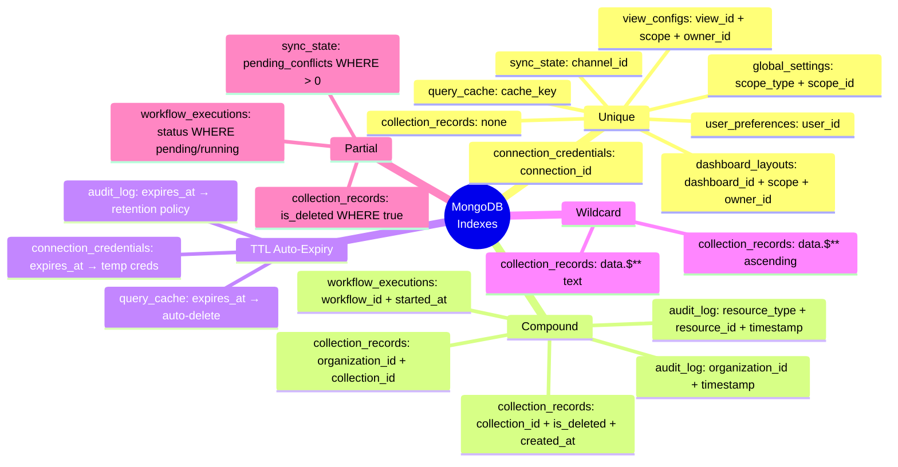
```mermaid
---
title: MongoDB Index Types Used Across Collections
---
mindmap
  root((MongoDB<br/>Indexes))
    Unique
      collection_records: none
      dashboard_layouts: dashboard_id + scope + owner_id
      view_configs: view_id + scope + owner_id
      user_preferences: user_id
      global_settings: scope_type + scope_id
      query_cache: cache_key
      sync_state: channel_id
      connection_credentials: connection_id
    Compound
      collection_records: collection_id + is_deleted + created_at
      collection_records: organization_id + collection_id
      audit_log: organization_id + timestamp
      audit_log: resource_type + resource_id + timestamp
      workflow_executions: workflow_id + started_at
    TTL Auto-Expiry
      query_cache: expires_at → auto-delete
      audit_log: expires_at → retention policy
      connection_credentials: expires_at → temp creds
    Wildcard
      collection_records: data.$** text
      collection_records: data.$** ascending
    Partial
      collection_records: is_deleted WHERE true
      workflow_executions: status WHERE pending/running
      sync_state: pending_conflicts WHERE > 0
```

---

## 7 — Multi-Tenant Isolation Pattern

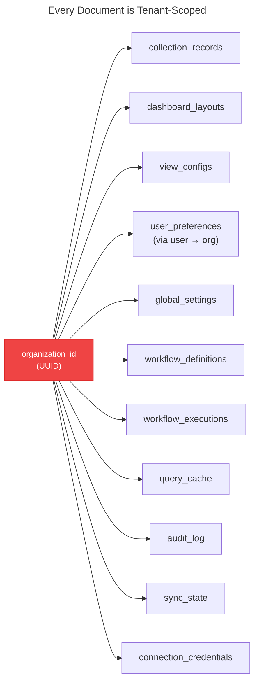
```mermaid
---
title: Every Document is Tenant-Scoped
---
flowchart LR
    ORG["organization_id\n(UUID)"]

    ORG --> CR["collection_records"]
    ORG --> DL["dashboard_layouts"]
    ORG --> VC["view_configs"]
    ORG --> UP["user_preferences\n(via user → org)"]
    ORG --> GS["global_settings"]
    ORG --> WD["workflow_definitions"]
    ORG --> WE["workflow_executions"]
    ORG --> QC["query_cache"]
    ORG --> AL["audit_log"]
    ORG --> SS["sync_state"]
    ORG --> CC["connection_credentials"]

    style ORG fill:#ef4444,stroke:#dc2626,color:#fff,font-size:14px
```

> **Rule**: Every query MUST include `organization_id` in its filter.
> This is enforced at the application layer (NestJS guards + Mongoose middleware).
> All compound indexes start with `organization_id` for partition-friendly access.

---

## 8 — CDC Real-Time Sync Pipeline

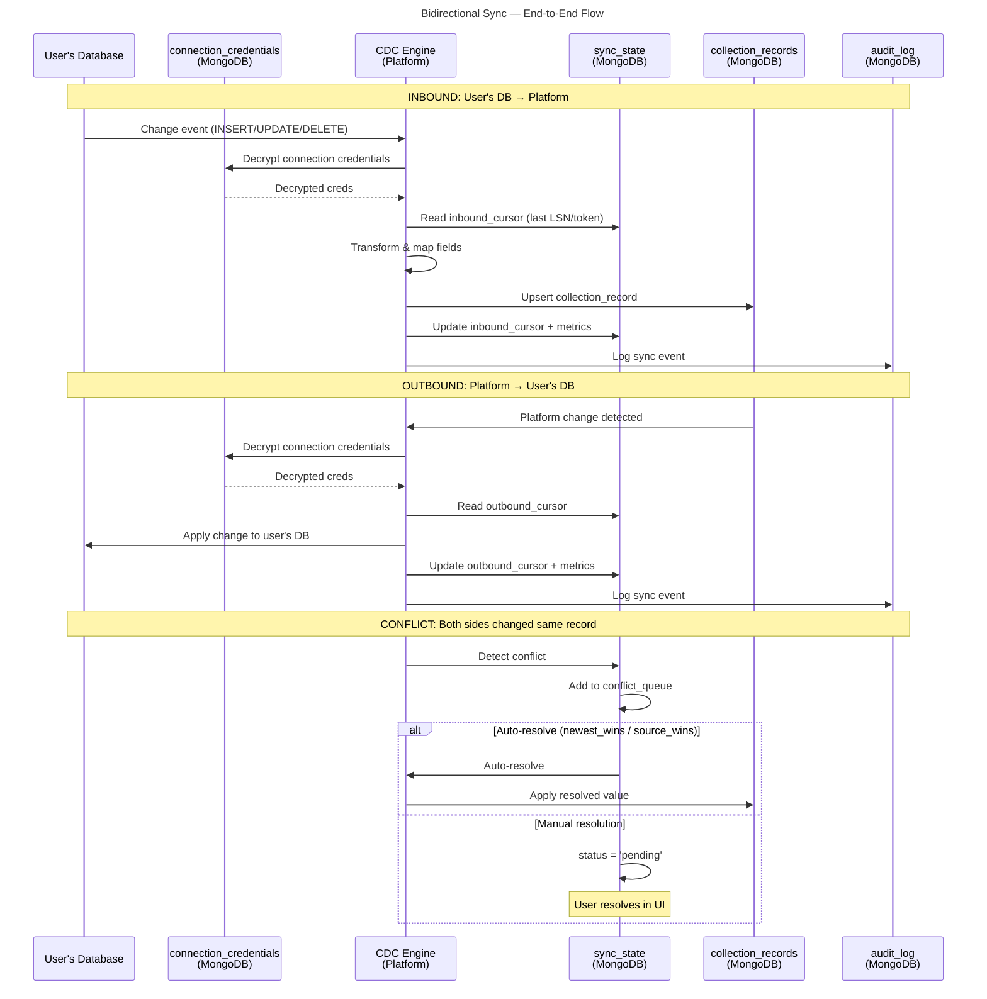
```mermaid
---
title: Bidirectional Sync — End-to-End Flow
---
sequenceDiagram
    participant UserDB as User's Database
    participant CC as connection_credentials<br/>(MongoDB)
    participant Engine as CDC Engine<br/>(Platform)
    participant SS as sync_state<br/>(MongoDB)
    participant CR as collection_records<br/>(MongoDB)
    participant AL as audit_log<br/>(MongoDB)

    Note over UserDB,AL: INBOUND: User's DB → Platform

    UserDB->>Engine: Change event (INSERT/UPDATE/DELETE)
    Engine->>CC: Decrypt connection credentials
    CC-->>Engine: Decrypted creds
    Engine->>SS: Read inbound_cursor (last LSN/token)
    Engine->>Engine: Transform & map fields
    Engine->>CR: Upsert collection_record
    Engine->>SS: Update inbound_cursor + metrics
    Engine->>AL: Log sync event

    Note over UserDB,AL: OUTBOUND: Platform → User's DB

    CR->>Engine: Platform change detected
    Engine->>CC: Decrypt connection credentials
    CC-->>Engine: Decrypted creds
    Engine->>SS: Read outbound_cursor
    Engine->>UserDB: Apply change to user's DB
    Engine->>SS: Update outbound_cursor + metrics
    Engine->>AL: Log sync event

    Note over UserDB,AL: CONFLICT: Both sides changed same record

    Engine->>SS: Detect conflict
    SS->>SS: Add to conflict_queue
    alt Auto-resolve (newest_wins / source_wins)
        SS->>Engine: Auto-resolve
        Engine->>CR: Apply resolved value
    else Manual resolution
        SS->>SS: status = 'pending'
        Note over SS: User resolves in UI
    end
```
