# PostgreSQL Schema — Complete SQL Architecture

> 55 tables across 9 schema files.
> Strict **5NF** normalization. UUID primary keys via `gen_random_uuid()`.
> Multi-tenant isolation via `organization_id` on every business table.
> RBAC + ABAC layered permission model.

---

## Table of Contents

1. [CMR — Class Model Relationship (Entity-Relationship)](#1--cmr--class-model-relationship)
2. [UMM — UML Model Map (Domain Map)](#2--umm--uml-model-map)
3. [UML — Class Diagrams per Domain](#3--uml--class-diagrams-per-domain)
4. [Use Case Diagrams](#4--use-case-diagrams)
5. [Sequence Diagrams](#5--sequence-diagrams)
6. [Flowcharts](#6--flowcharts)

---

## 1 — CMR — Class Model Relationship

### 1.1 — Master ER Diagram (All Domains)

```mermaid
---
title: Full Entity-Relationship Diagram — 55 Tables
---
erDiagram
    %% ═══════════════════════════════════════════
    %% IDENTITY & AUTH (schema.user.sql)
    %% ═══════════════════════════════════════════

    users {
        UUID id PK
        VARCHAR email UK
        VARCHAR username UK
        VARCHAR display_name
        TEXT password_hash
        BOOLEAN is_active
        BOOLEAN mfa_enabled
        VARCHAR status
    }

    oauth_accounts {
        UUID id PK
        UUID user_id FK
        VARCHAR provider
        VARCHAR provider_id
        TEXT access_token
    }

    roles {
        UUID id PK
        UUID organization_id FK
        VARCHAR name
        VARCHAR scope
        BOOLEAN is_system
    }

    permissions {
        UUID id PK
        VARCHAR name UK
        VARCHAR resource_type
        VARCHAR action
    }

    role_permissions {
        UUID role_id PK_FK
        UUID permission_id PK_FK
    }

    user_role_assignments {
        UUID id PK
        UUID user_id FK
        UUID role_id FK
        VARCHAR context_type
        UUID context_id
        TIMESTAMPTZ expires_at
    }

    abac_conditions {
        UUID id PK
        UUID permission_id FK
        UUID role_id FK
        VARCHAR attribute_key
        VARCHAR operator
        JSONB attribute_value
    }

    user_permissions {
        UUID id PK
        UUID user_id FK
        UUID permission_id FK
        BOOLEAN granted
        TIMESTAMPTZ expires_at
    }

    user_sessions {
        UUID id PK
        UUID user_id FK
        VARCHAR token_hash
        INET ip_address
        BOOLEAN is_active
    }

    contacts {
        UUID id PK
        UUID user_id FK
        UUID contact_user_id FK
        VARCHAR first_name
        VARCHAR last_name
    }

    api_keys {
        UUID id PK
        UUID user_id FK
        VARCHAR name
        VARCHAR key_hash UK
        BOOLEAN is_active
    }

    %% ═══════════════════════════════════════════
    %% ORGANIZATION HIERARCHY (schema.organization.sql)
    %% ═══════════════════════════════════════════

    organizations {
        UUID id PK
        VARCHAR name
        VARCHAR slug UK
        UUID created_by FK
        BOOLEAN is_active
    }

    organization_members {
        UUID id PK
        UUID organization_id FK
        UUID user_id FK
        UUID invited_by FK
    }

    projects {
        UUID id PK
        UUID organization_id FK
        VARCHAR name
        VARCHAR slug
        UUID created_by FK
    }

    project_members {
        UUID id PK
        UUID project_id FK
        UUID user_id FK
        UUID invited_by FK
    }

    workspaces {
        UUID id PK
        UUID project_id FK
        VARCHAR name
        VARCHAR slug
        VARCHAR type
        UUID created_by FK
    }

    workspace_members {
        UUID id PK
        UUID workspace_id FK
        UUID user_id FK
        UUID invited_by FK
    }

    %% ═══════════════════════════════════════════
    %% COLLECTIONS (schema.collection.sql)
    %% ═══════════════════════════════════════════

    collections {
        UUID id PK
        UUID workspace_id FK
        VARCHAR name
        VARCHAR slug
        VARCHAR field_type
        INT record_count
        UUID created_by FK
    }

    fields {
        UUID id PK
        UUID collection_id FK
        VARCHAR name
        VARCHAR slug
        VARCHAR field_type
        BOOLEAN is_required
        JSONB validation_rules
    }

    field_options {
        UUID id PK
        UUID field_id FK
        VARCHAR label
        VARCHAR value
    }

    collection_relations {
        UUID id PK
        UUID source_collection_id FK
        UUID target_collection_id FK
        UUID source_field_id FK
        VARCHAR relation_type
    }

    collection_indices {
        UUID id PK
        UUID collection_id FK
        VARCHAR name
        TEXT_ARRAY field_slugs
    }

    %% ═══════════════════════════════════════════
    %% DASHBOARDS & VIEWS (schema.dashboard.sql)
    %% ═══════════════════════════════════════════

    dashboards {
        UUID id PK
        UUID workspace_id FK
        VARCHAR name
        VARCHAR slug
        VARCHAR visibility
        UUID created_by FK
    }

    dashboard_permissions {
        UUID id PK
        UUID dashboard_id FK
        VARCHAR grantee_type
        UUID grantee_id
        BOOLEAN can_view
        BOOLEAN can_edit
    }

    views {
        UUID id PK
        UUID collection_id FK
        UUID workspace_id FK
        VARCHAR name
        VARCHAR view_type
        VARCHAR visibility
        UUID created_by FK
    }

    view_permissions {
        UUID id PK
        UUID view_id FK
        VARCHAR grantee_type
        UUID grantee_id
    }

    dashboard_templates {
        UUID id PK
        UUID organization_id FK
        VARCHAR name
        VARCHAR category
        JSONB template_data
    }

    %% ═══════════════════════════════════════════
    %% RESOURCES (schema.resource.sql)
    %% ═══════════════════════════════════════════

    resources {
        UUID id PK
        UUID organization_id FK
        VARCHAR resource_type
        UUID resource_id
        VARCHAR name
    }

    resource_permissions {
        UUID id PK
        UUID resource_id FK
        VARCHAR grantee_type
        UUID grantee_id
        VARCHAR_ARRAY actions
    }

    resource_versions {
        UUID id PK
        UUID resource_id FK
        INT version_number
        JSONB snapshot
    }

    resource_shares {
        UUID id PK
        UUID resource_id FK
        VARCHAR share_type
        VARCHAR share_token UK
        BOOLEAN is_active
    }

    resource_relations {
        UUID id PK
        UUID source_resource_id FK
        UUID target_resource_id FK
        VARCHAR relation_type
    }

    tags {
        UUID id PK
        UUID organization_id FK
        VARCHAR name
        VARCHAR slug
    }

    resource_tags {
        UUID resource_id PK_FK
        UUID tag_id PK_FK
    }

    comments {
        UUID id PK
        UUID resource_id FK
        UUID user_id FK
        UUID parent_id FK
        TEXT content
        BOOLEAN is_resolved
    }

    %% ═══════════════════════════════════════════
    %% ADAPTERS (schema.adapter.sql)
    %% ═══════════════════════════════════════════

    adapters {
        UUID id PK
        UUID organization_id FK
        VARCHAR name
        VARCHAR adapter_type
        JSONB connection_config
        VARCHAR health_status
    }

    adapter_mappings {
        UUID id PK
        UUID adapter_id FK
        UUID collection_id FK
        VARCHAR source_path
        JSONB field_mappings
        VARCHAR sync_direction
    }

    adapter_executions {
        UUID id PK
        UUID adapter_id FK
        UUID mapping_id FK
        VARCHAR status
        INT records_processed
    }

    %% ═══════════════════════════════════════════
    %% SYSTEM (schema.system.sql)
    %% ═══════════════════════════════════════════

    webhooks {
        UUID id PK
        UUID organization_id FK
        VARCHAR name
        TEXT url
        VARCHAR_ARRAY events
        BOOLEAN is_active
    }

    webhook_deliveries {
        UUID id PK
        UUID webhook_id FK
        VARCHAR event_type
        INT response_status
    }

    notifications {
        UUID id PK
        UUID user_id FK
        VARCHAR type
        VARCHAR title
        BOOLEAN is_read
    }

    policy_rules {
        UUID id PK
        UUID organization_id FK
        VARCHAR name
        VARCHAR resource_type
        JSONB conditions
        VARCHAR effect
    }

    file_uploads {
        UUID id PK
        UUID organization_id FK
        VARCHAR filename
        BIGINT size_bytes
        VARCHAR storage_backend
    }

    %% ═══════════════════════════════════════════
    %% BILLING (schema.billing.sql)
    %% ═══════════════════════════════════════════

    plans {
        UUID id PK
        VARCHAR slug UK
        VARCHAR name
        INT price_monthly
        INT price_yearly
    }

    plan_features {
        UUID id PK
        UUID plan_id FK
        VARCHAR feature_key
        INT limit_value
    }

    promotions {
        UUID id PK
        VARCHAR code UK
        VARCHAR name
        VARCHAR discount_type
        INT discount_value
    }

    subscriptions {
        UUID id PK
        UUID organization_id FK
        UUID plan_id FK
        UUID promotion_id FK
        VARCHAR status
        VARCHAR billing_period
    }

    promotion_plans {
        UUID promotion_id PK_FK
        UUID plan_id PK_FK
    }

    invoices {
        UUID id PK
        UUID subscription_id FK
        UUID organization_id FK
        VARCHAR invoice_number
        VARCHAR status
        INT total_amount
    }

    payments {
        UUID id PK
        UUID invoice_id FK
        UUID organization_id FK
        INT amount
        VARCHAR status
        VARCHAR payment_method
    }

    usage_meters {
        UUID id PK
        VARCHAR slug UK
        VARCHAR name
        VARCHAR unit
        VARCHAR aggregation
    }

    usage_records {
        UUID id PK
        UUID organization_id FK
        UUID meter_id FK
        BIGINT quantity
    }

    %% ═══════════════════════════════════════════
    %% CONNECTIVITY (schema.connectivity.sql)
    %% ═══════════════════════════════════════════

    provisioned_databases {
        UUID id PK
        UUID organization_id FK
        VARCHAR name
        VARCHAR provider
        VARCHAR engine
        VARCHAR tier
        VARCHAR status
    }

    database_connections {
        UUID id PK
        UUID organization_id FK
        UUID project_id FK
        VARCHAR name
        VARCHAR connection_type
        VARCHAR engine
        UUID credential_ref
        UUID provisioned_db_id FK
    }

    sync_channels {
        UUID id PK
        UUID connection_id FK
        UUID collection_id FK
        VARCHAR source_path
        VARCHAR sync_mode
        VARCHAR sync_direction
        VARCHAR status
    }

    sync_executions {
        UUID id PK
        UUID channel_id FK
        VARCHAR status
        VARCHAR direction
        INT records_processed
    }

    %% ═══════════════════════════════════════════
    %% RELATIONSHIPS
    %% ═══════════════════════════════════════════

    users ||--o{ oauth_accounts : "has"
    users ||--o{ user_role_assignments : "assigned"
    users ||--o{ user_permissions : "granted"
    users ||--o{ user_sessions : "logs in"
    users ||--o{ contacts : "owns"
    users ||--o{ api_keys : "generates"
    users ||--o{ notifications : "receives"

    roles ||--o{ role_permissions : "includes"
    permissions ||--o{ role_permissions : "granted via"
    roles ||--o{ user_role_assignments : "assigned to"
    roles ||--o{ abac_conditions : "scoped by"
    permissions ||--o{ abac_conditions : "constrained by"
    permissions ||--o{ user_permissions : "overridden"

    organizations ||--o{ roles : "defines"
    organizations ||--o{ organization_members : "has"
    organizations ||--o{ projects : "contains"
    organizations ||--o{ resources : "owns"
    organizations ||--o{ adapters : "configures"
    organizations ||--o{ webhooks : "registers"
    organizations ||--o{ policy_rules : "enforces"
    organizations ||--o{ file_uploads : "stores"
    organizations ||--o{ tags : "creates"
    organizations ||--o{ subscriptions : "subscribes"
    organizations ||--o{ invoices : "billed"
    organizations ||--o{ payments : "pays"
    organizations ||--o{ usage_records : "metered"
    organizations ||--o{ database_connections : "connects"
    organizations ||--o{ provisioned_databases : "provisions"
    organizations ||--o{ dashboard_templates : "offers"

    organization_members }o--|| users : "is"
    project_members }o--|| users : "is"
    workspace_members }o--|| users : "is"

    projects ||--o{ project_members : "has"
    projects ||--o{ workspaces : "contains"

    workspaces ||--o{ workspace_members : "has"
    workspaces ||--o{ collections : "contains"
    workspaces ||--o{ dashboards : "displays"
    workspaces ||--o{ views : "shows"

    collections ||--o{ fields : "defines"
    collections ||--o{ collection_indices : "indexed by"
    collections ||--o{ views : "viewed as"
    fields ||--o{ field_options : "has"
    collections ||--o{ collection_relations : "source"
    collections ||--o{ collection_relations : "target"

    dashboards ||--o{ dashboard_permissions : "grants"
    views ||--o{ view_permissions : "grants"

    resources ||--o{ resource_permissions : "grants"
    resources ||--o{ resource_versions : "versioned"
    resources ||--o{ resource_shares : "shared via"
    resources ||--o{ resource_relations : "relates"
    resources ||--o{ resource_tags : "tagged"
    resources ||--o{ comments : "commented"
    tags ||--o{ resource_tags : "applied"
    comments ||--o{ comments : "replies"

    adapters ||--o{ adapter_mappings : "maps"
    adapters ||--o{ adapter_executions : "runs"
    adapter_mappings }o--|| collections : "targets"

    webhooks ||--o{ webhook_deliveries : "delivers"

    plans ||--o{ plan_features : "includes"
    plans ||--o{ subscriptions : "subscribed"
    plans ||--o{ promotion_plans : "eligible"
    promotions ||--o{ promotion_plans : "applies to"
    promotions ||--o{ subscriptions : "discounts"
    subscriptions ||--o{ invoices : "generates"
    invoices ||--o{ payments : "paid by"
    usage_meters ||--o{ usage_records : "tracks"

    provisioned_databases ||--o| database_connections : "linked"
    database_connections ||--o{ sync_channels : "syncs via"
    sync_channels }o--|| collections : "syncs to"
    sync_channels ||--o{ sync_executions : "logs"
```

### 1.2 — Identity & Access Control ERD (Focused)

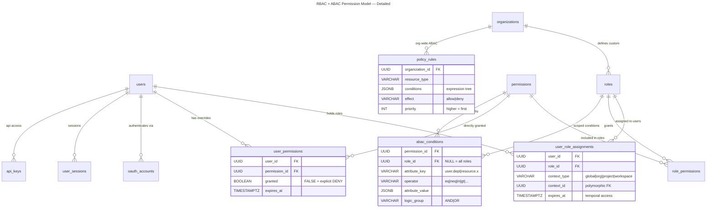

### 1.3 — Billing & Monetization ERD (Focused)

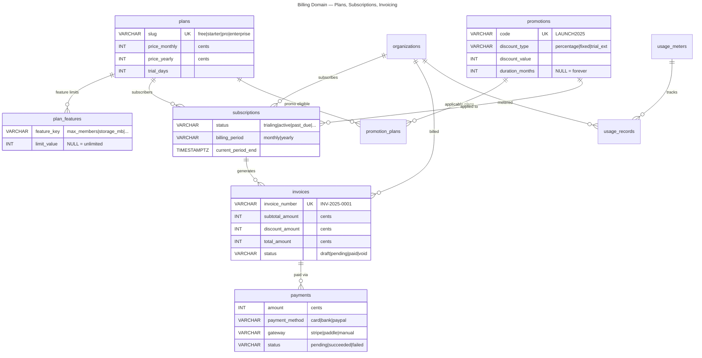

### 1.4 — Connectivity & Sync ERD (Focused)

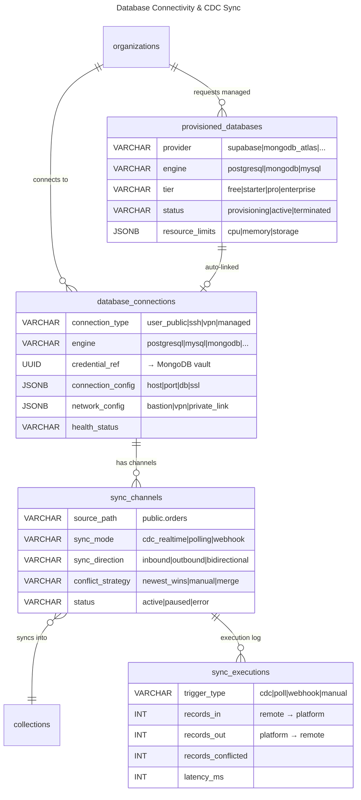

---

## 2 — UMM — UML Model Map

### 2.1 — Domain Dependency Map

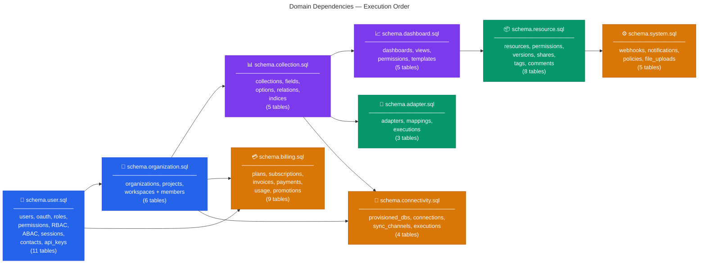

### 2.2 — Multi-Tenant Hierarchy

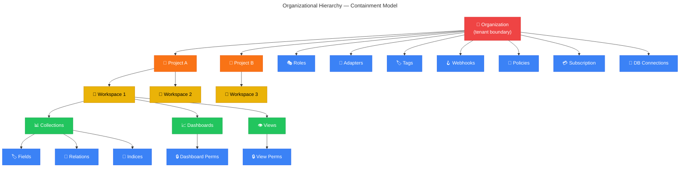

### 2.3 — Schema File Table Count

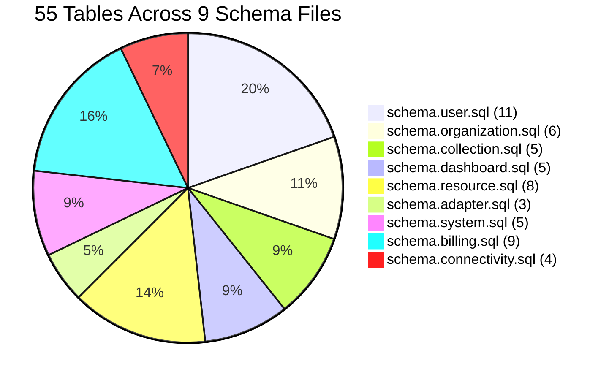

---

## 3 — UML — Class Diagrams per Domain

### 3.1 — Identity & Auth

```mermaid
---
title: schema.user.sql — Identity, Auth & RBAC/ABAC
---
classDiagram
    class users {
        +UUID id
        +VARCHAR email
        +VARCHAR username
        +VARCHAR display_name
        +TEXT password_hash
        +BOOLEAN is_active
        +BOOLEAN mfa_enabled
        +TEXT mfa_secret
        +VARCHAR status
        +TIMESTAMPTZ last_login_at
        +TIMESTAMPTZ last_seen_at
    }

    class oauth_accounts {
        +UUID id
        +UUID user_id
        +VARCHAR provider
        +VARCHAR provider_id
        +TEXT access_token
        +TEXT refresh_token
        +TIMESTAMPTZ token_expires_at
    }

    class roles {
        +UUID id
        +UUID organization_id
        +VARCHAR name
        +TEXT description
        +VARCHAR scope
        +BOOLEAN is_system
    }

    class permissions {
        +UUID id
        +VARCHAR name
        +TEXT description
        +VARCHAR resource_type
        +VARCHAR action
    }

    class role_permissions {
        +UUID role_id
        +UUID permission_id
    }

    class user_role_assignments {
        +UUID id
        +UUID user_id
        +UUID role_id
        +VARCHAR context_type
        +UUID context_id
        +UUID assigned_by
        +TIMESTAMPTZ expires_at
    }

    class abac_conditions {
        +UUID id
        +UUID permission_id
        +UUID role_id
        +VARCHAR attribute_key
        +VARCHAR operator
        +JSONB attribute_value
        +VARCHAR logic_group
    }

    class user_permissions {
        +UUID id
        +UUID user_id
        +UUID permission_id
        +BOOLEAN granted
        +UUID granted_by
        +TIMESTAMPTZ expires_at
    }

    class user_sessions {
        +UUID id
        +UUID user_id
        +VARCHAR token_hash
        +INET ip_address
        +TEXT user_agent
        +BOOLEAN is_active
        +TIMESTAMPTZ expires_at
    }

    class contacts {
        +UUID id
        +UUID user_id
        +UUID contact_user_id
        +VARCHAR first_name
        +VARCHAR last_name
        +VARCHAR email
        +VARCHAR phone
        +JSONB metadata
    }

    class api_keys {
        +UUID id
        +UUID user_id
        +VARCHAR name
        +VARCHAR key_hash
        +VARCHAR[] scopes
        +BOOLEAN is_active
        +TIMESTAMPTZ expires_at
    }

    users "1" --> "*" oauth_accounts
    users "1" --> "*" user_role_assignments
    users "1" --> "*" user_permissions
    users "1" --> "*" user_sessions
    users "1" --> "*" contacts
    users "1" --> "*" api_keys
    roles "1" --> "*" role_permissions
    permissions "1" --> "*" role_permissions
    roles "1" --> "*" user_role_assignments
    permissions "1" --> "*" abac_conditions
    roles "0..1" --> "*" abac_conditions : "optional scope"
    permissions "1" --> "*" user_permissions

    note for roles "scope: global | organization |\nproject | workspace\n\nis_system = TRUE → immutable"
    note for user_role_assignments "context_type + context_id =\npolymorphic scope target\n\nexpires_at = temporal access"
    note for abac_conditions "role_id NULL → applies to ALL roles\nrole_id SET → only that role"
```

### 3.2 — Organization Hierarchy

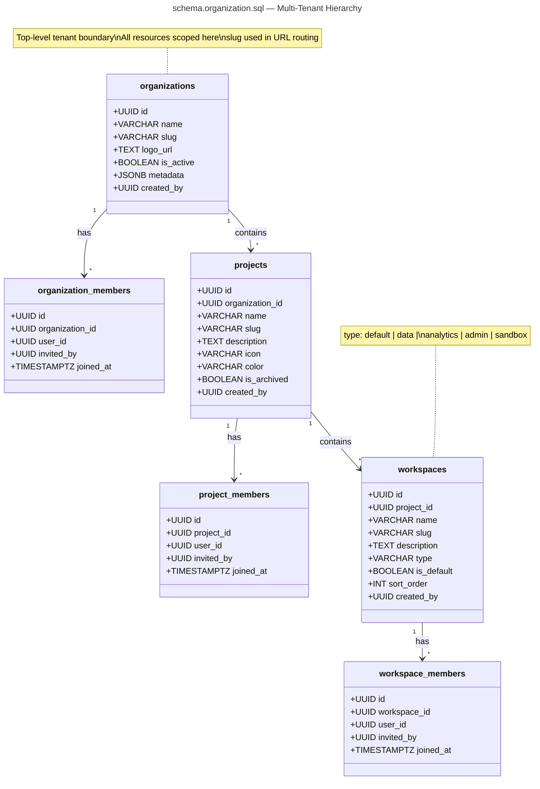

### 3.3 — Collection Schema Engine

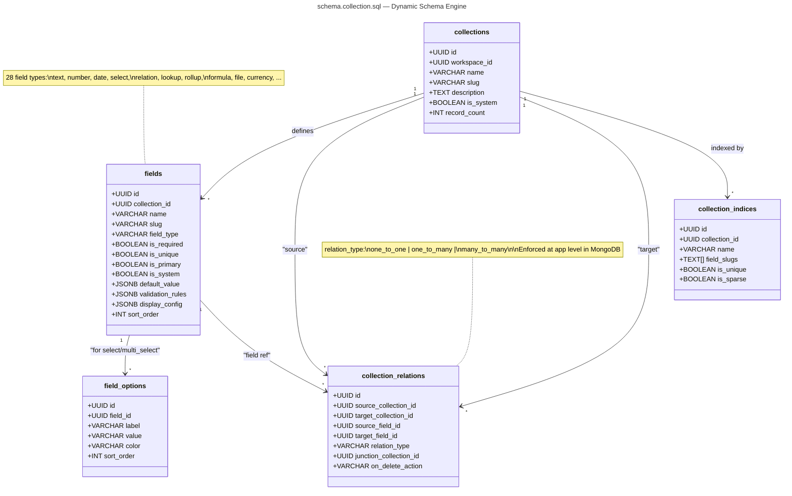

### 3.4 — Presentation Layer

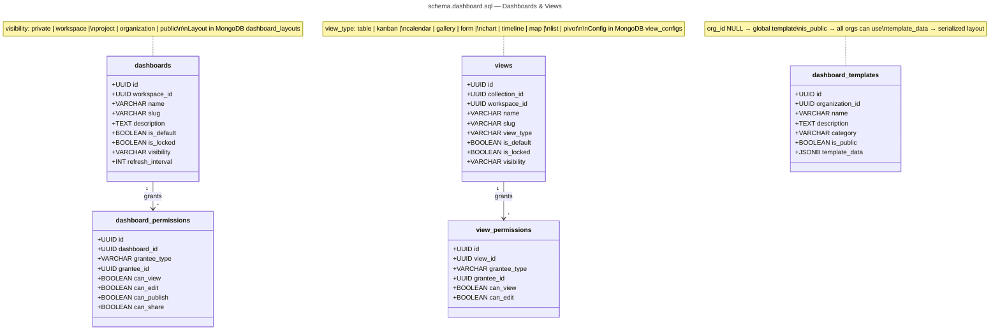

### 3.5 — Resource Registry

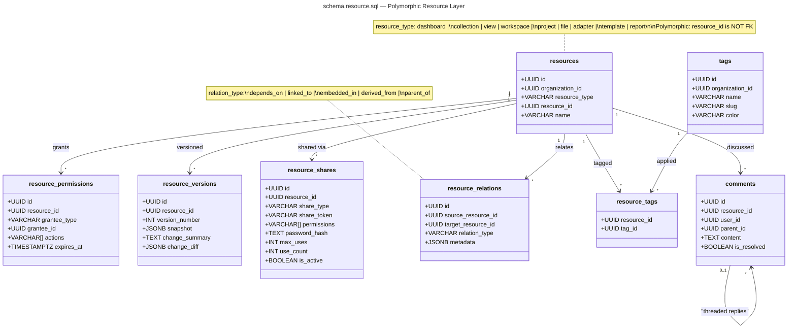

---

## 4 — Use Case Diagrams

### 4.1 — Platform Actors & Use Cases

```mermaid
---
title: Platform Use Cases — All Actors
---
flowchart LR
    classDef actor fill:#3b82f6,stroke:#2563eb,color:#fff
    classDef usecase fill:#f8fafc,stroke:#94a3b8,color:#0f172a
    classDef system fill:#f59e0b,stroke:#d97706,color:#000

    GUEST["👤 Guest"]:::actor
    USER["👤 Authenticated\nUser"]:::actor
    ADMIN["👤 Org Admin"]:::actor
    BILLING["👤 Billing\nAdmin"]:::actor
    PLATFORM["👤 Platform\nSuper Admin"]:::actor
    SYSTEM["⚙️ System\n(Cron/CDC)"]:::system

    subgraph AUTH["Authentication"]
        UC1["Register / Login"]:::usecase
        UC2["OAuth Login\n(42/Google/GitHub)"]:::usecase
        UC3["Enable MFA"]:::usecase
        UC4["Manage API Keys"]:::usecase
    end

    subgraph DATA["Data Management"]
        UC5["Create Collection"]:::usecase
        UC6["Define Fields\n& Relations"]:::usecase
        UC7["CRUD Records\n(→ MongoDB)"]:::usecase
        UC8["Create Views\n(table/kanban/chart)"]:::usecase
        UC9["Build Dashboards\n& Widgets"]:::usecase
    end

    subgraph COLLAB["Collaboration"]
        UC10["Invite Members"]:::usecase
        UC11["Assign Roles"]:::usecase
        UC12["Share Resources\n(link/email/embed)"]:::usecase
        UC13["Comment &\nThread"]:::usecase
        UC14["Tag Resources"]:::usecase
    end

    subgraph INTEGRATION["Integration & Sync"]
        UC15["Configure Adapter\n(REST/CSV/Sheets)"]:::usecase
        UC16["Connect External DB"]:::usecase
        UC17["Setup CDC\nSync Channel"]:::usecase
        UC18["Provision Managed\nDB (Supabase/Atlas)"]:::usecase
    end

    subgraph BILLING_UC["Billing & Usage"]
        UC19["Subscribe to Plan"]:::usecase
        UC20["Apply Promo Code"]:::usecase
        UC21["View Invoices\n& Pay"]:::usecase
        UC22["Monitor Usage\nQuotas"]:::usecase
    end

    subgraph ADMIN_UC["Administration"]
        UC23["Define ABAC\nConditions"]:::usecase
        UC24["Create Policy\nRules"]:::usecase
        UC25["Configure Webhooks"]:::usecase
        UC26["Manage File\nUploads"]:::usecase
        UC27["Set Org Branding\n& Security"]:::usecase
    end

    subgraph SYSTEM_UC["System Processes"]
        UC28["Execute Adapter\nSync"]:::usecase
        UC29["CDC Change\nPropagation"]:::usecase
        UC30["Webhook\nDelivery"]:::usecase
        UC31["Usage Metering"]:::usecase
        UC32["Session Cleanup"]:::usecase
    end

    GUEST --> UC1
    GUEST --> UC2

    USER --> UC3
    USER --> UC4
    USER --> UC5
    USER --> UC6
    USER --> UC7
    USER --> UC8
    USER --> UC9
    USER --> UC13
    USER --> UC14

    ADMIN --> UC10
    ADMIN --> UC11
    ADMIN --> UC12
    ADMIN --> UC15
    ADMIN --> UC16
    ADMIN --> UC17
    ADMIN --> UC23
    ADMIN --> UC24
    ADMIN --> UC25
    ADMIN --> UC26
    ADMIN --> UC27

    BILLING --> UC19
    BILLING --> UC20
    BILLING --> UC21
    BILLING --> UC22

    PLATFORM --> UC18
    PLATFORM --> UC24

    SYSTEM --> UC28
    SYSTEM --> UC29
    SYSTEM --> UC30
    SYSTEM --> UC31
    SYSTEM --> UC32
```

### 4.2 — Data Management Use Cases (Detailed)

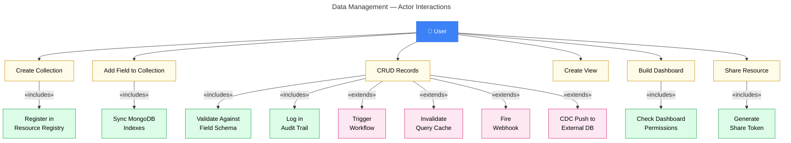

---

## 5 — Sequence Diagrams

### 5.1 — Permission Resolution Chain

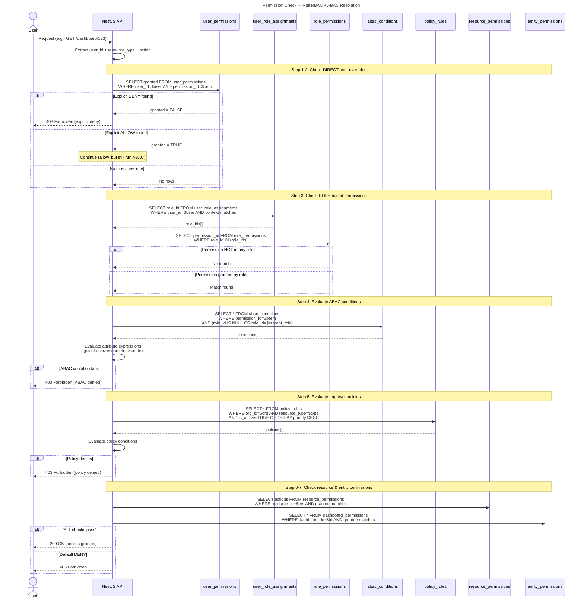

### 5.2 — Record CRUD with Validation

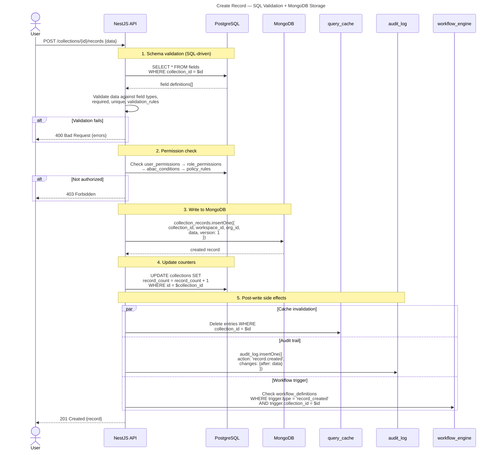

### 5.3 — Subscription & Billing Flow

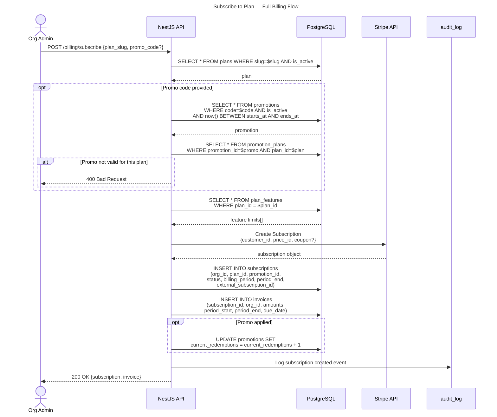

### 5.4 — CDC Real-Time Sync

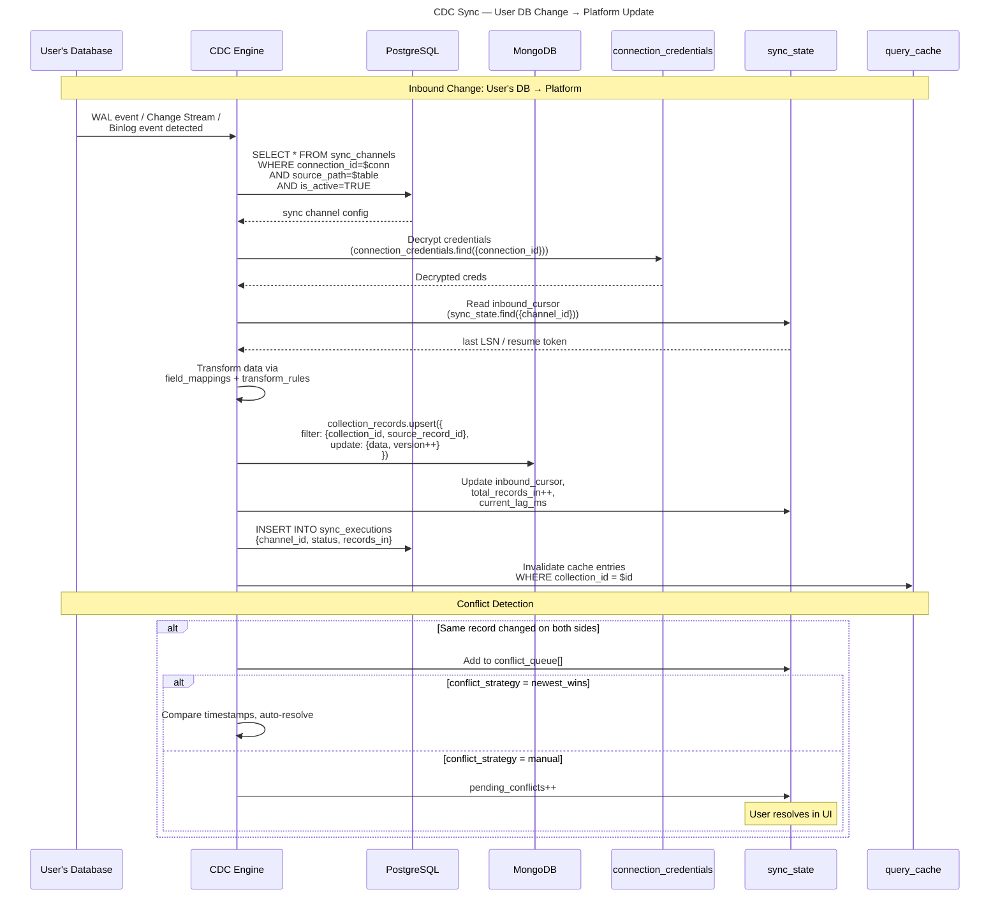

### 5.5 — Adapter Sync Execution

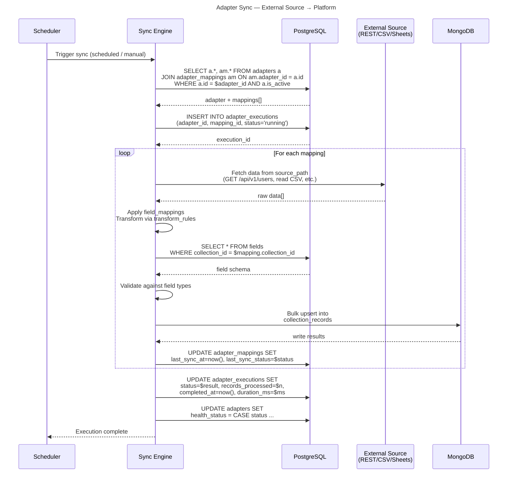

---

## 6 — Flowcharts

### 6.1 — Permission Resolution Flowchart

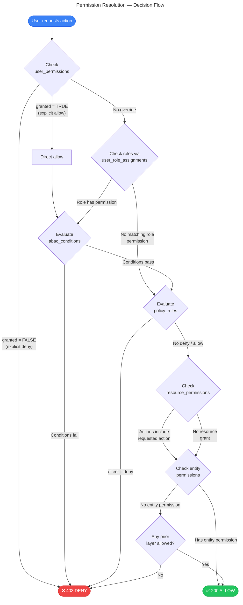

### 6.2 — Record Lifecycle Flowchart

```mermaid
---
title: Record Lifecycle — From Creation to Deletion
---
flowchart TD
    classDef sql fill:#f59e0b,stroke:#d97706,color:#000
    classDef mongo fill:#3b82f6,stroke:#2563eb,color:#fff
    classDef action fill:#22c55e,stroke:#16a34a,color:#fff
    classDef check fill:#f8fafc,stroke:#94a3b8,color:#0f172a

    START([User submits data]) --> VALIDATE{Validate against<br/>SQL fields table}:::sql

    VALIDATE -->|"Invalid"| ERROR([400 Bad Request])
    VALIDATE -->|"Valid"| PERM{Permission<br/>check (RBAC+ABAC)}:::sql

    PERM -->|"Denied"| FORBIDDEN([403 Forbidden])
    PERM -->|"Allowed"| WRITE[Write to MongoDB<br/>collection_records]:::mongo

    WRITE --> PAR1[/Parallel side effects/]

    PAR1 --> COUNT[Update SQL<br/>record_count]:::sql
    PAR1 --> AUDIT[Insert MongoDB<br/>audit_log]:::mongo
    PAR1 --> CACHE[Invalidate<br/>query_cache]:::mongo
    PAR1 --> WFCHECK{Matching<br/>workflow?}:::check

    WFCHECK -->|"Yes"| WF_EXEC[Create workflow<br/>execution]:::mongo
    WFCHECK -->|"No"| SKIP1[Skip]

    PAR1 --> HOOKCHECK{Matching<br/>webhook?}:::check
    HOOKCHECK -->|"Yes"| HOOK_FIRE[Fire webhook<br/>+ log delivery]:::sql
    HOOKCHECK -->|"No"| SKIP2[Skip]

    PAR1 --> CDCCHECK{Active CDC<br/>sync channel?}:::check
    CDCCHECK -->|"Yes"| CDC_PUSH[Push to user's<br/>external DB]:::action
    CDCCHECK -->|"No"| SKIP3[Skip]

    COUNT --> DONE([201 Created])
    AUDIT --> DONE
    CACHE --> DONE

    style ERROR fill:#ef4444,stroke:#dc2626,color:#fff
    style FORBIDDEN fill:#ef4444,stroke:#dc2626,color:#fff
    style DONE fill:#22c55e,stroke:#16a34a,color:#fff
```

### 6.3 — Subscription Lifecycle Flowchart

```mermaid
---
title: Subscription Status Lifecycle
---
stateDiagram-v2
    [*] --> trialing : Org creates subscription\n(plan has trial_days > 0)
    [*] --> active : Org subscribes\n(no trial)

    trialing --> active : Trial ends +\npayment succeeds
    trialing --> cancelled : Trial ends +\nno payment method

    active --> past_due : Payment fails
    active --> paused : Admin pauses
    active --> cancelled : Admin cancels\n(cancel_at_period_end)

    past_due --> active : Retry payment succeeds
    past_due --> cancelled : Max retries exceeded

    paused --> active : Admin reactivates

    cancelled --> expired : Period ends
    expired --> [*]

    note right of active
        Normal operating state.
        Invoices generated per cycle.
        Usage metered continuously.
    end note

    note right of past_due
        Grace period.
        Stripe retries payment.
        Features may be limited.
    end note
```

### 6.4 — Database Connection Setup Flow

```mermaid
---
title: External DB Connection — Setup Flow
---
flowchart TD
    START([Admin initiates\nDB connection]) --> TYPE{Connection\ntype?}

    TYPE -->|"User-owned DB"| CREDS[Collect credentials\n(host, port, user, pass)]
    TYPE -->|"Managed / Provisioned"| PROVIDER{Select\nprovider}

    PROVIDER -->|"Supabase"| PROV_SB[Provision via\nSupabase Management API]
    PROVIDER -->|"MongoDB Atlas"| PROV_ATLAS[Provision via\nAtlas Admin API]

    PROV_SB --> AUTO_CONN[Auto-create\ndatabase_connection]
    PROV_ATLAS --> AUTO_CONN

    CREDS --> ENCRYPT[Encrypt credentials\nAES-256-GCM]
    ENCRYPT --> STORE[Store in MongoDB\nconnection_credentials]
    STORE --> CREATE_CONN[Create SQL\ndatabase_connections row\n(credential_ref → MongoDB)]

    AUTO_CONN --> TEST_CONN
    CREATE_CONN --> TEST_CONN{Test\nconnection}

    TEST_CONN -->|"Failed"| FAIL([Connection failed\nUpdate health_status])
    TEST_CONN -->|"Success"| INTROSPECT[Introspect remote\nschema]

    INTROSPECT --> CACHE_SCHEMA[Cache schema in\nschema_cache JSONB]
    CACHE_SCHEMA --> SETUP_SYNC{Setup sync\nchannel?}

    SETUP_SYNC -->|"Yes"| MAP_FIELDS[Map remote fields\n→ local fields]
    SETUP_SYNC -->|"No"| DONE([Connection ready\nhealth_status = healthy])

    MAP_FIELDS --> CREATE_COLL[Create/link\nSQL collection + fields]
    CREATE_COLL --> CREATE_CHAN[Create SQL\nsync_channel]
    CREATE_CHAN --> INIT_STATE[Initialize MongoDB\nsync_state document]
    INIT_STATE --> START_CDC{Sync mode?}

    START_CDC -->|"CDC Realtime"| SLOT[Create replication\nslot / change stream]
    START_CDC -->|"Polling"| POLL[Start polling\ntimer]
    START_CDC -->|"Webhook"| WEBHOOK_EP[Register webhook\nendpoint]

    SLOT --> ACTIVE([Sync active ✅])
    POLL --> ACTIVE
    WEBHOOK_EP --> ACTIVE

    style FAIL fill:#ef4444,stroke:#dc2626,color:#fff
    style DONE fill:#22c55e,stroke:#16a34a,color:#fff
    style ACTIVE fill:#22c55e,stroke:#16a34a,color:#fff
```

### 6.5 — Webhook Delivery Flow

```mermaid
---
title: Webhook Delivery — Event to Delivery
---
flowchart TD
    EVENT([Platform event fires\ne.g., record.created]) --> MATCH{Find matching\nwebhooks}

    MATCH --> QUERY[SELECT * FROM webhooks\nWHERE org_id=$org\nAND $event = ANY events\nAND is_active = TRUE]

    QUERY --> FOUND{Webhooks\nfound?}

    FOUND -->|"None"| DONE_NO([No delivery needed])
    FOUND -->|"1+ found"| LOOP[/For each webhook/]

    LOOP --> SIGN[Compute HMAC signature\nusing secret_hash]
    SIGN --> POST[POST to webhook.url\nwith payload + signature\n+ custom headers]

    POST --> RESP{Response\nstatus?}

    RESP -->|"2xx"| LOG_OK[Log delivery:\nstatus=success,\nresponse_status, duration_ms]
    RESP -->|"4xx/5xx\nor timeout"| RETRY{Attempt <\nretry_count?}

    RETRY -->|"Yes"| DELAY[Wait retry_delay_ms\n× attempt_number]
    DELAY --> POST
    RETRY -->|"No, max retries"| LOG_FAIL[Log delivery:\nstatus=failed,\nerror details]

    LOG_OK --> UPDATE[UPDATE webhooks SET\nlast_triggered_at, last_status]
    LOG_FAIL --> UPDATE

    UPDATE --> NEXT{More\nwebhooks?}
    NEXT -->|"Yes"| LOOP
    NEXT -->|"No"| DONE([All deliveries complete])

    style DONE_NO fill:#94a3b8,stroke:#64748b,color:#fff
    style DONE fill:#22c55e,stroke:#16a34a,color:#fff
    style LOG_FAIL fill:#ef4444,stroke:#dc2626,color:#fff
```

### 6.6 — Invoice Generation Flow

```mermaid
---
title: Invoice Generation — Billing Cycle
---
flowchart TD
    TRIGGER([Billing cycle ends\nor cron triggers]) --> FETCH[SELECT * FROM subscriptions\nWHERE status = 'active'\nAND current_period_end <= now]

    FETCH --> LOOP[/For each subscription/]

    LOOP --> PLAN[Fetch plan pricing\nplans.price_monthly/yearly]
    PLAN --> USAGE[Aggregate usage_records\nfor billing period]
    USAGE --> OVERAGE{Usage exceeds\nplan limits?}

    OVERAGE -->|"Yes"| CALC_OVER[Calculate overage\ncharges]
    OVERAGE -->|"No"| BASE[Base plan amount only]

    CALC_OVER --> PROMO
    BASE --> PROMO{Active\npromotion?}

    PROMO -->|"Yes"| DISCOUNT[Apply discount:\npercentage or fixed]
    PROMO -->|"No"| TAX

    DISCOUNT --> TAX[Calculate tax]
    TAX --> CREATE_INV[INSERT INTO invoices\nsubtotal, discount, tax, total]

    CREATE_INV --> CHARGE{Auto-charge\nenabled?}

    CHARGE -->|"Yes"| STRIPE[Charge via Stripe\n(external_customer_id)]
    CHARGE -->|"No"| PENDING([Invoice status: pending\nAwait manual payment])

    STRIPE --> SUCCESS{Payment\nsucceeded?}

    SUCCESS -->|"Yes"| PAID[UPDATE invoice status='paid'\nINSERT INTO payments status='succeeded'\nAdvance subscription period]
    SUCCESS -->|"No"| PAST_DUE[UPDATE invoice status='past_due'\nUPDATE subscription status='past_due'\nINSERT INTO payments status='failed']

    PAID --> NEXT{More\nsubscriptions?}
    PAST_DUE --> NEXT
    PENDING --> NEXT

    NEXT -->|"Yes"| LOOP
    NEXT -->|"No"| DONE([Billing cycle complete])

    style DONE fill:#22c55e,stroke:#16a34a,color:#fff
    style PAST_DUE fill:#ef4444,stroke:#dc2626,color:#fff
    style PENDING fill:#f59e0b,stroke:#d97706,color:#000
```

---

## Appendix — Table Reference

| # | Schema File | Table | Purpose |
|---|---|---|---|
| 1 | user | `users` | Core identity |
| 2 | user | `oauth_accounts` | OAuth provider links |
| 3 | user | `roles` | RBAC role definitions |
| 4 | user | `permissions` | Atomic permission atoms |
| 5 | user | `role_permissions` | Role ↔ Permission junction |
| 6 | user | `user_role_assignments` | User ↔ Role scoped binding |
| 7 | user | `abac_conditions` | Attribute conditions on permissions |
| 8 | user | `user_permissions` | Direct user permission overrides |
| 9 | user | `user_sessions` | Active login sessions |
| 10 | user | `contacts` | Personal address book |
| 11 | user | `api_keys` | Programmatic API tokens |
| 12 | organization | `organizations` | Top-level tenant |
| 13 | organization | `organization_members` | Org membership |
| 14 | organization | `projects` | Logical project groupings |
| 15 | organization | `project_members` | Project membership |
| 16 | organization | `workspaces` | Data containers |
| 17 | organization | `workspace_members` | Workspace membership |
| 18 | collection | `collections` | Tenant-defined data tables |
| 19 | collection | `fields` | Column definitions (28 types) |
| 20 | collection | `field_options` | Select/multi-select options |
| 21 | collection | `collection_relations` | Inter-collection relations |
| 22 | collection | `collection_indices` | Custom MongoDB indexes |
| 23 | dashboard | `dashboards` | Dashboard identity |
| 24 | dashboard | `dashboard_permissions` | Per-dashboard access |
| 25 | dashboard | `views` | View identity (10 types) |
| 26 | dashboard | `view_permissions` | Per-view access |
| 27 | dashboard | `dashboard_templates` | Reusable layout templates |
| 28 | resource | `resources` | Polymorphic resource registry |
| 29 | resource | `resource_permissions` | Resource-level access |
| 30 | resource | `resource_versions` | Snapshot versioning |
| 31 | resource | `resource_shares` | Shareable links |
| 32 | resource | `resource_relations` | Cross-resource relations |
| 33 | resource | `tags` | Org-scoped taxonomy |
| 34 | resource | `resource_tags` | Resource ↔ Tag junction |
| 35 | resource | `comments` | Threaded comments |
| 36 | adapter | `adapters` | External source connections |
| 37 | adapter | `adapter_mappings` | Source → Collection mappings |
| 38 | adapter | `adapter_executions` | Sync execution log |
| 39 | system | `webhooks` | Outbound event hooks |
| 40 | system | `webhook_deliveries` | Delivery attempt log |
| 41 | system | `notifications` | In-app notifications |
| 42 | system | `policy_rules` | Org-level ABAC policies |
| 43 | system | `file_uploads` | Managed file attachments |
| 44 | billing | `plans` | Subscription tiers |
| 45 | billing | `plan_features` | Feature limits per plan |
| 46 | billing | `promotions` | Discount codes / coupons |
| 47 | billing | `subscriptions` | Org ↔ Plan binding |
| 48 | billing | `promotion_plans` | Promo ↔ Plan junction |
| 49 | billing | `invoices` | Billing invoices |
| 50 | billing | `payments` | Payment transactions |
| 51 | billing | `usage_meters` | Metering definitions |
| 52 | billing | `usage_records` | Actual usage data points |
| 53 | connectivity | `provisioned_databases` | Managed DB instances |
| 54 | connectivity | `database_connections` | External DB connections |
| 55 | connectivity | `sync_channels` | CDC sync channel config |
| 56 | connectivity | `sync_executions` | Sync operation log |
